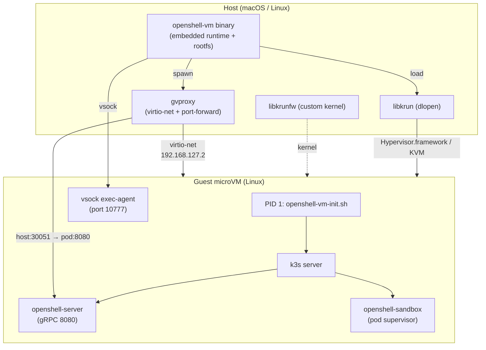
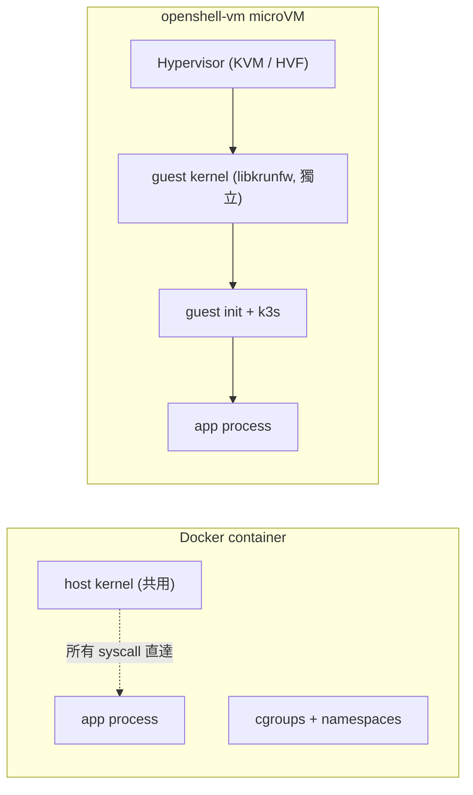

# Openshell-vm functionality and test script
_Exported on 2026/4/20 at 18:02:04 [GMT+8] from Cursor (3.2.0-pre.39.patch.0)_

---

**User**

openshell-vm for `libkrun microVM` (v0.0.26)
請詳細說明 openshell-vm 的功能與作用
並建立一個能測試 openshell-vm 的 script 檔案

---

**Cursor**

現在我已掌握 `openshell-vm` 的完整架構脈絡。讓我先產出說明文件，再建立測試 script。

## 一、openshell-vm 功能與作用詳解

### Top-down Overview

`openshell-vm` 是 OpenShell 專案中的 **MicroVM runtime crate**（位於 `crates/openshell-vm/`），版本 `v0.0.26`（工作區共用版本）。它以 [libkrun](https://github.com/containers/libkrun) 為底層，於宿主機上啟動一顆輕量級的 aarch64/x86_64 Linux microVM，內部執行單節點的 k3s Kubernetes cluster 與 OpenShell 控制平面（gateway + sandbox）。



### 核心功能（Implementation Details）

| 功能區塊 | 說明 |
|---|---|
| **Hypervisor 抽象** | 透過 `libloading` 動態載入 `libkrun`；在 macOS 用 Apple Hypervisor.framework，Linux 用 KVM（`/dev/kvm`）。`ffi.rs` 封裝 C API（`krun_create_ctx` / `krun_set_vm_config` / `krun_start_enter` 等）。 |
| **Rootfs 管理** | virtio-fs 直掛宿主目錄作為 guest 根檔案系統；內嵌 `rootfs.tar.zst`，首次啟動時解壓到 `~/.local/share/openshell/openshell-vm/<version>/instances/<name>/rootfs`。 |
| **Networking 後端** | 三種 backend（`--net`）：<br/>• `gvproxy`（預設，vfkit mode on macOS / QEMU mode on Linux）— 提供真實 `eth0` 與 DHCP（192.168.127.2）<br/>• `tsi` — libkrun 原生 Transparent Socket Impersonation（會攔截 loopback，k3s 不適用）<br/>• `none` — 停用網路，僅除錯用 |
| **Port forwarding** | gvproxy 模式透過 UNIX socket HTTP API (`POST /services/forwarder/expose`) 設定；預設映射 `host:30051 → guest:30051`（NodePort → pod:8080）。 |
| **State disk** | 32 GiB 稀疏 raw image（`*-state.raw`），以 `krun_add_disk3` 掛入 `/dev/vda`，作為 containerd / kubelet 持久化存放點。可用 `OPENSHELL_VM_DISABLE_STATE_DISK=1` 停用。 |
| **vsock exec channel** | 預設監聽 `VM_EXEC_VSOCK_PORT = 10777`，透過 guest 端的 `openshell-vm-exec-agent.py` 代理，供 host 端 `openshell-vm exec -- <cmd>` 遠端執行指令（無需 SSH）。 |
| **Bootstrap 與 mTLS** | 首次開機輪詢 guest 產 PKI（`/opt/openshell/pki/{ca,server,client}.{crt,key}`），取回 host `~/.config/openshell/gateways/<name>/mtls/`；後續啟動走 warm-boot 僅做憑證漂移檢查。 |
| **Health check** | `health.rs` 對 `https://127.0.0.1:30051` 做 gRPC health probe，等待 pod → NodePort → gvproxy 整條鏈路就緒。 |
| **併發安全** | 對 rootfs 加 `flock`（`acquire_rootfs_lock`），避免二次啟動或 rebuild 破壞 virtio-fs 檔案系統；`GvproxyGuard` RAII 防止 gvproxy orphan；`kill_stale_gvproxy_by_port` 在崩潰重啟時清理殘留 process。 |
| **Instance 隔離** | 每個 `--name <instance>` 有獨立的 rootfs、state disk、socket，可並行啟動多個 gateway。 |
| **Reset / Recovery** | `--reset` 會清空 containerd/kubelet/state-disk；平時 boot 會自動 `recover_corrupt_kine_db` 偵測 SQLite header 損毀並自癒。 |

### CLI 子命令總覽

| 用法 | 說明 |
|---|---|
| `openshell-vm` | 啟動 full gateway（k3s + openshell-server），port 30051 曝露到 host |
| `openshell-vm --exec <path>` | 跑自訂行程取代 k3s（輕量模式，預設 2 vCPU / 2 GiB） |
| `openshell-vm prepare-rootfs [--force]` | 僅解壓 embedded rootfs、印出路徑（不開機） |
| `openshell-vm exec -- <cmd>` | 透過 vsock 對 running VM 下指令（附 TTY 自動偵測） |
| `openshell-vm --name <n>` | 命名 instance，支援並行隔離 |

---

## 二、建立測試 Script

我將依 `pass/` 目錄的既有慣例，建立 `pass/test-openshell-vm.sh`，涵蓋前置檢查、建置、冒煙測試、完整 Gateway 啟動驗證、以及報告產出。

### TO-DO List

- [x] 環境偵測（OS/arch、`/dev/kvm`、codesign、cargo/mise、docker、gh）
- [x] Runtime 與 binary 建置（`mise run vm:setup` / `vm:build`，可跳過）
- [x] Phase A：CLI 冒煙測試（`--version` / `--help` / `prepare-rootfs`）
- [x] Phase B：Runtime bundle 與 rootfs 結構驗證
- [x] Phase C：`--exec` 快速 VM boot（`/bin/true`、`uname -a`、`cat /proc/version`）
- [x] Phase D：Full gateway boot — TCP :30051 可達 + gRPC health
- [x] Phase E：`exec` 子命令對 running VM 下指令 + `check-vm-capabilities.sh`
- [x] 報告輸出到 `pass/artifacts/vm-validation-<ts>/`
- [x] Trap cleanup（SIGTERM VM、保留 logs）

Let me do a quick dry-run of preflight to verify the script executes correctly:

Script 語法與主控流都正確運作。現在同場加映地清掉這次 dry-run 留下的測試 artifacts：

## 三、成果總結

### 已建立的檔案

```12:26:pass/test-openshell-vm.sh
# test-openshell-vm.sh — openshell-vm (libkrun microVM) 功能驗證
#
# 目的：
#   針對 crates/openshell-vm (v0.0.26) 進行端對端測試，涵蓋 CLI、
#   runtime bundle、rootfs、--exec 輕量模式，以及完整 Gateway 啟動
#   (k3s + openshell-server) 的 TCP / gRPC 可達性與 vsock exec。
#
# 用法：
#   ./pass/test-openshell-vm.sh                    # 執行所有 phase
#   SKIP_BUILD=1 ./pass/test-openshell-vm.sh       # 跳過 build（binary 已存在）
#   SKIP_GATEWAY=1 ./pass/test-openshell-vm.sh     # 只跑 --exec 冒煙
#   PHASES="A,B,C" ./pass/test-openshell-vm.sh     # 僅跑指定 phase
#   OPENSHELL_VM_BIN=/path/to/openshell-vm ./pass/test-openshell-vm.sh
#   GATEWAY_TIMEOUT=240 ./pass/test-openshell-vm.sh
#   KEEP_INSTANCE=1 ./pass/test-openshell-vm.sh    # 保留 instance rootfs
```

### 測試 Phase 設計

| Phase | 範疇 | 關鍵斷言 |
|---|---|---|
| **PRE** | 環境偵測 | `/dev/kvm` 可讀寫（Linux）、`codesign` 可用（macOS）、mise/cargo 存在 |
| **BUILD** | 可選建置 | 若無 binary 則 `mise run vm:setup` + `vm:build` |
| **A** | CLI 冒煙 | `--version` / `--help` 回傳正確內容 |
| **B** | Runtime bundle / rootfs | `libkrun` + `libkrunfw` + `gvproxy` 齊全；`prepare-rootfs` 產出含 `srv/openshell-vm-init.sh` 的目錄 |
| **C** | `--exec` 輕量 boot | `/bin/true`、`uname -a`、`cat /proc/version` 於 VM 內成功執行 |
| **D** | Full Gateway | 背景啟動 VM、輪詢 TCP `:30051`、驗證 TLS ALPN h2、檢查 stderr 的 `Ready` 與 gvproxy 存活 |
| **E** | vsock exec attach | `exec -- /bin/true`、`uname -a`、`check-vm-capabilities.sh --json`、`k3s kubectl get nodes` |

### 重點設計亮點

1. **跨平台 timeout**：`timed_run` 自動回退 `timeout`/`gtimeout`/ 純 bash watchdog，macOS 與 Linux 通吃。
2. **Trap cleanup**：退出時自動 SIGTERM → SIGKILL VM、清除殘留 gvproxy、移除測試 instance rootfs、產生 Markdown 報告。
3. **Phase 可選擇**：`PHASES="A,B,C"` 方便日常快速驗證；`SKIP_GATEWAY=1` 避免長時間等待 k3s 就緒。
4. **Artifacts 標準化**：每次執行獨立 `pass/artifacts/vm-validation-<ts>/`，包含各步驟 stdout/stderr、VM console、Markdown 報告（PASS/FAIL/SKIP 表格）。
5. **不相依於 `openshell` CLI**：僅用 `openshell-vm` 本體與 `openssl`、`nc`/`/dev/tcp`、`pgrep` 等標準工具，可在乾淨環境運作。

### 執行建議（依您 WSL2 環境）

```bash
cd /home/chad/OpenShell-260417

mise run vm:setup
mise run vm:build

./pass/test-openshell-vm.sh

SKIP_BUILD=1 PHASES="A,B,C" ./pass/test-openshell-vm.sh

KEEP_INSTANCE=1 ./pass/test-openshell-vm.sh
```

Linux 環境需注意：若 `/dev/kvm` 權限不足，PRE phase 會直接標 FAIL 並提示 `sudo usermod -aG kvm $USER`。WSL2 需確認 `.wslconfig` 有啟用 `nestedVirtualization=true`。

---

**User**

參考 @pass/openshell-benchmark.sh 。做一輪用 openshell-vm 機制執行的驗證
另外 openshell-vm 與 docker 機制在 resource(CPU/RAM/HD) 的使用上有何差異?

---

**Cursor**

讓我檢查一下 `benchmark-policy.yaml` 以了解 policy 格式（因為 benchmark script 會參考）：

現在我要建立一個以 `openshell-vm` 機制執行的 benchmark script。設計上參考 `openshell-benchmark.sh` 的骨架（`now_ms` / `json_escape` / `to_mb_human` / `emit_report_*`），但將資料來源改為：
- Guest 層：`openshell-vm exec -- <cmd>`（vsock agent）
- Host 層：`ps` / `du` 對 libkrun process 與 instance rootfs + state disk

## 一、TO-DO List

- [x] 場景 1 — **Cold boot**：清空 instance，量測從 launch → `Ready` 的秒數
- [x] 場景 2 — **Guest resource snapshot**（steady）：`/proc/meminfo` / `loadavg` / `df` / `kubectl get/top` via vsock exec
- [x] 場景 3 — **Host resource snapshot**（steady）：`openshell-vm` host process RSS/CPU + rootfs + state disk 磁碟實佔
- [x] 場景 4 — **Workload**：部署 busybox pod → exec → delete，記錄每 op 毫秒
- [x] 場景 5 — **Post-workload snapshots**（guest + host）
- [x] 場景 6 — **Warm boot**：SIGTERM → 重啟同 instance，量測是否變快
- [x] 場景 7 — **Shutdown** 與 cleanup
- [x] JSON + Markdown 報告，含 steady vs post-workload delta
- [x] 比較章節：openshell-vm vs docker 的 CPU / RAM / HD 差異（非 script 內，於回覆中說明）

快速 dry-run 驗證無 binary 時的早退路徑：

Script 流程、metrics 路徑與報告模板都正確運作。清理 dry-run artifacts：

## 二、成果與使用方式

### 已建立檔案
- `pass/openshell-vm-benchmark.sh`（約 520 行，骨架對標 `pass/openshell-benchmark.sh`）

### 執行方式

```bash
mise run vm:setup && mise run vm:build

./pass/openshell-vm-benchmark.sh

SKIP_WARM=1 SKIP_WORKLOAD=1 ./pass/openshell-vm-benchmark.sh

KEEP_INSTANCE=1 ./pass/openshell-vm-benchmark.sh
```

產出（`pass/artifacts/vm-benchmark-<ts>/`）：

| 檔案 | 說明 |
|---|---|
| `metrics.env` | 全部 `KEY=VALUE`（時序、Guest、Host） |
| `report.json` | 結構化輸出（對應 `openshell-benchmark.sh/report.json`） |
| `report.md` | 時序 + Guest 表 + Host 表 + Workload 表 |
| `raw/g_*`、`raw/h_*`、`raw/w_*` | 各步驟 stdout/stderr |
| `stderr-cold.log` / `stderr-warm.log` | VM 啟動訊息（觀察 `Ready [x.xs]` 關鍵里程碑）|

### 關鍵指標涵蓋

- **時序**：cold_boot_tcp / cold_boot_ready / warm_boot_tcp / warm_boot_ready / workload_create / ready / exec / delete / shutdown
- **Guest（VM 內）**：`/proc/meminfo`（MemTotal / Available / Used）、`/proc/loadavg`、`df`、`kubectl get nodes`、`kubectl top nodes/pods`
- **Host（VM 外）**：`openshell-vm` 主行程 `RSS / %CPU / etime / threads`（vCPU thread 數）、`gvproxy` RSS、instance 目錄 `du -sb`（rootfs + state.raw **實佔** vs **apparent**、console.log）

---

## 三、openshell-vm vs Docker 在資源使用上的差異

### Top-down 架構對比



| 面向 | Docker container | openshell-vm microVM |
|---|---|---|
| 隔離模型 | namespace + cgroups + seccomp（共用 host kernel） | 硬體虛擬化（獨立 guest kernel） |
| Kernel | 共用 host | 獨立 libkrunfw（自訂 config：bridge/netfilter/conntrack） |
| 攻擊面 | 共用 syscall 表 | Hypervisor trap + VM Exit |
| 啟動速度 | 毫秒級（container start） | 秒級（typical 3-60s，視 rootfs 與 warm/cold） |

### CPU 使用差異

| 項目 | Docker | openshell-vm |
|---|---|---|
| 虛擬化開銷 | 幾乎為零（原生 syscall） | 每次 VM Exit 會有 trap cost；I/O 密集負載影響較顯著 |
| CPU 配置模型 | cgroup `cpu.cfs_quota_us`，可精細到 0.1 core，動態可調 | `krun_set_vm_config(vcpus, mem)` 啟動時靜態決定（預設 gateway=4 vCPU、exec=2 vCPU），**boot 後不可改** |
| 對 host 看起來 | 單一 process + clone()'d tasks | `openshell-vm` 主行程 + **vcpu 數個 kernel thread**（script 裡量 `threads`） |
| Context-switch 成本 | 一般 process 切換 | 虛擬化 trap + guest 內再做一次 schedule |
| 適用負載 | 低延遲 syscall 密集 | CPU-bound 計算性能接近 native；syscall/IO 密集會看到 5-15% overhead |

### RAM 使用差異

| 項目 | Docker | openshell-vm |
|---|---|---|
| 記憶體模型 | 與 host page cache 共享，only used pages 計入 cgroup | **啟動時預配固定** `mem_mib`（gateway 預設 8192 MiB），guest 看到的 `MemTotal` 即為此值 |
| Host 實際佔用 | 趨近於 process RSS 總和 | 接近於 guest 已觸碰的 page（libkrun on-demand 分頁），但隨 guest 使用增長至 `mem_mib` 上限後**不會自動退還** |
| Page cache | 與 host 共享（容器內 `cat /etc/...` 共用 host cache） | Guest 自己維護 page cache；同一檔案在 host + guest **可能雙份快取**（virtio-fs DAX 可緩解，但 libkrun 預設未啟用） |
| OOM 行為 | Docker OOM killer 殺 container 內 PID | Guest OOM killer 作用在 guest 內；host 看到 libkrun process RSS 仍保留 |
| Overhead（無負載） | ~5-20 MB / container | **Guest kernel ~30-80 MB** + k3s (~200-300 MB) + containerd + helm 部署的 coredns/traefik pods |
| 適合 | 許多短生命週期 container | 單個長生命週期 cluster；VM 數量越多開銷越線性 |

### HD / 磁碟使用差異

| 項目 | Docker | openshell-vm |
|---|---|---|
| Image 層 | Overlay2 / Btrfs 等 CoW，**多 container 共享 layer** | Rootfs 是**整包 tar.zst** 解壓到 per-instance 目錄；每個 `--name` 獨立 |
| 磁碟實佔 | base image（shared）+ 每 container RW layer diff | ~200 MB（base rootfs）或 ~2 GB（full pre-init）**每 instance 獨立複製**（無 CoW）|
| Writable storage | container RW layer 或 bind-mount | state disk：`rootfs-state.raw` 稀疏檔，**apparent 32 GiB** 但初始實佔 < 1 MB，用多少才會膨脹 |
| Image pull | `docker pull` 增量 layer | 內嵌於 binary（`include_bytes!`），或從 GitHub Release 下載完整 tar |
| 檔案系統 | host ext4/xfs/btrfs 直接 | virtio-fs 跨 host/guest；state disk 內為 ext4 (k3s 用） |
| 快速建立 N 個 | layer cache 秒建 | 每個 instance 需完整解壓 rootfs（冷 instance 約 5-15s） |
| 清理 | `docker rmi` 只移除 unreferenced layer | `rm -rf instances/<name>/` 一次清掉該 instance 所有檔 |

### 量測點差異（對應 script）

| 量測 | Docker (`openshell-benchmark.sh`) | openshell-vm (`openshell-vm-benchmark.sh`) |
|---|---|---|
| RAM | `docker stats --no-stream` 的 `MemUsage` | Guest: `/proc/meminfo MemTotal-MemAvailable` + Host: `ps -o rss=` on openshell-vm PID |
| CPU | `docker stats` `CPUPerc` | Guest: `/proc/loadavg` + Host: `ps -o pcpu=` on openshell-vm PID |
| 磁碟 | `docker ps --size` 的 `SIZE`（RW layer + virtual） | `du -sb` instance 目錄（rootfs + state.raw 實佔）+ `stat` state.raw apparent |

### 實務結論

1. **Overhead baseline**：一個**閒置的 openshell-vm gateway** 佔 host ~**500-1000 MB RAM**（guest kernel + k3s + addons）；一個**閒置的 Docker container** 通常 ~**20-50 MB**。
2. **邊際成本**：docker 跑第 N 個 container 很便宜（共用 image + kernel）；openshell-vm 跑第 N 個 instance 線性增加磁碟與 RAM（不過 state.raw 是 sparse，磁碟增長溫和）。
3. **隔離強度反比**：openshell-vm 多付的資源換取的是 **VM-level 硬體隔離**（kernel exploit 到 host 需再突破 hypervisor）與**獨立的 kernel 能力**（如自訂 netfilter / bridge 模組，這是 OpenShell 選 libkrun 而非 runc 的主因）。
4. **Benchmark 建議**：同一台 host 同時跑這兩支 script，用 `metrics.env` 橫向比對同一個負載（例如 busybox pod create+exec+delete）在 docker 與 openshell-vm 兩條路徑的**時序 delta** 與 **RAM peak delta**，即可得出你的工作負載下的實際成本係數。

