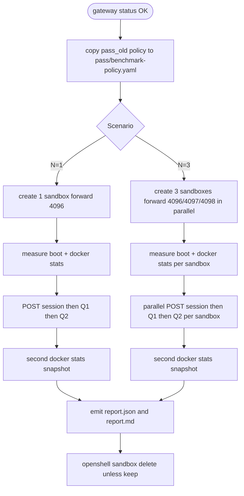

# OpenShell opencode serve benchmark 計畫

## 1. 目標與輸出

- **主要輸出**：`pass/openshell-benchmark.sh` —— 一支可重跑的 benchmark 腳本。
- **量測維度**：Scenario ∈ {N=1, N=3} × 每個 sandbox 一輪 Q1+Q2。
- **產出檔案**（每次跑產生一個 run-id 目錄）：
  - `pass/artifacts/benchmark-<run-id>/run.log`
  - `pass/artifacts/benchmark-<run-id>/report.json`（所有 metric 原始值）
  - `pass/artifacts/benchmark-<run-id>/report.md`（矩陣表，給人看）
  - 每個 sandbox 目錄下：`qa_q1.json`、`qa_q2.json`、`sandbox_get.txt`、`docker_stats.txt`、`global_health.json`

## 2. 復用既有資產

- **網路政策**：沿用 [pass_old/qa-realtime-policy.yaml](pass_old/qa-realtime-policy.yaml)（已含 `mcp.exa.ai:443` 的 `POST /mcp` + `GET /**` 規則、`api.exchangerate.host`、`www.twse.com.tw`、`api.exa.ai`、`opencode.ai`、`registry.npmjs.org`、`integrate.api.nvidia.com`）。複製一份到 `pass/benchmark-policy.yaml` 讓 `pass/` 自成一套；不修改 `pass_old/`。
- **啟動方式**：沿用 [pass_old/openshell-validate.sh](pass_old/openshell-validate.sh) 第 146–156 行的作法——用 `OPENCODE_CONFIG_CONTENT='{"$schema":"https://opencode.ai/config.json","model":"opencode/minimax-m2.5-free"}' opencode serve --hostname 127.0.0.1 --port <PORT>` 注入預設模型，不依賴 `opencode serve --model`。
- **Q&A 協定**：沿用 POST `/session`（建立 session）→ POST `/session/{id}/message`（送 Q1、Q2）的流程（pass_old 腳本第 479–510 行）。

## 3. 腳本架構（`pass/openshell-benchmark.sh`）

```bash
# 參數（全部有預設）
--model opencode/minimax-m2.5-free          # 預設模型
--policy pass/benchmark-policy.yaml          # 網路 policy
--base-port 4096                             # N=3 會用 4096/4097/4098
--name-prefix bench                          # sandbox 名稱前綴
--scenarios n1,n3                            # 可單跑 n1 或 n3
--keep                                       # 不自動清理，方便人工檢視
```

主流程：

1. `openshell status`（gateway 健康檢查）。
2. 套 policy：對每個 sandbox `openshell sandbox create --policy <file> --name <prefix>-<scenario>-<idx> --auto-providers --forward <port> -- sh -lc "<serve_cmd>"`（背景啟動）。
3. 對每個 sandbox 量測：
   - `t_boot`：從 create 下指令的 monotonic 時戳，到 `GET http://localhost:<port>/global/health` 回 200 為止。
   - 取 steady-state 資源快照：`docker stats --no-stream` + `docker ps --size` 過濾該 sandbox 的 container ID（透過 `openshell sandbox get <name>` 取 container 參照；若欄位不存在，以 name label 反查 `docker ps --filter label=...`）。
   - `POST /session` 建立 session → `t_qa1`、`t_qa2` 分別是對應 POST 的 wall-clock。
4. 每次 QA 完成再取一次資源快照（觀察峰值/增幅）。
5. N=3 的三個 sandbox **同時啟動、同時跑 Q&A**（bash `&` + `wait`），用以暴露共用 gateway / proxy 的併發輪廓——這是相對於單跑最關鍵的資訊。
6. 清理：預設刪除所有 sandbox；`--keep` 時保留。

## 4. 資源量測來源與備援

- **首選**：`docker ps --size` 的 `SIZE` 欄 → rootfs 的 writable 層大小（disk）；`docker stats --no-stream --format '{{.MemUsage}} {{.CPUPerc}}'` → RAM/CPU。
- **sandbox container 定位**：先跑 `openshell sandbox get <name>` 把輸出存檔（人工核對用）；實務上以 `docker ps --format '{{.ID}} {{.Names}}' | grep <pattern>` 或 sandbox 的 label 取 container id。若 OpenShell 內嵌名字規則固定（例：`openshell-sandbox-<name>`），直接用名稱匹配。
- **備援**（若 docker 取不到）：`openshell logs <name> --source sandbox --since 1m` 內如有 mem/disk hint 再補錄；否則報告標註「disk:unavailable」不中斷。

## 5. 報告產出（`report.md` 矩陣範例）

用 bullet 列而非表格（依規範）：

- **Scenario N=1**
  - sandbox `bench-n1-0`：boot=Xs, qa1=Ys, qa2=Zs, mem_ss=A MiB, mem_peak=B MiB, disk=C MB
  - Q1 模型名回覆摘要、Q2 是否成功回傳匯率/是否觸發 mcp.exa.ai
- **Scenario N=3**
  - sandbox `bench-n3-0/1/2`：同上三組並排
  - 併發聚合：total_boot_wall, mean_qa1, p95_qa1, l7_deny_count（從 `openshell logs --level warn`）

## 6. 失敗與邊界處理

- Port 被占用：沿用 pass_old 腳本的 `pick_free_port` 邏輯（pass_old 腳本第 315–329 行）。
- `/global/health` 回 401/403：腳本明示要求執行者設定 `--auth-user/--auth-pass`（pass_old 腳本第 453–459 行的既有行為）。
- Q2 若模型自述「無法即時查詢」：照常存原文，但額外從 `openshell logs` 擷取 `l7_decision=` 行數（pass_old 腳本的 `extract-l7-denies.sh` 思路），報告裡明確區分「模型沒呼叫 tool」vs「tool 被 policy 擋」。
- 任一 sandbox 啟動失敗：N=3 仍會繼續量其他兩個，但 `report.json` 標示失敗者為 `status: "boot_failed"`，退出碼非 0。

## 7. 量測流程視覺化



## 8. 不在範圍內

- 不切換 provider（只保留 `opencode` + `opencode/minimax-m2.5-free`；`--model` 旗標保留但不做 gemini 路徑）。
- 不修改 `openshell` CLI 或 crate 程式碼，純 shell 腳本與 policy 複用。
- 不跑 `mise run e2e` / 不動既有測試 harness。
