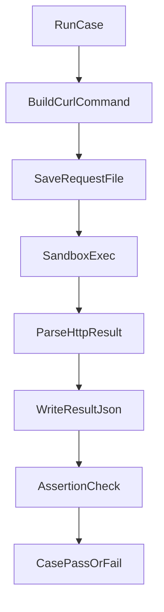

# 強化 `validate-policy-matrix.sh` 驗證輸出與診斷能力

## 目標
在不改變既有 `c01~c12` 功能驗證語意的前提下，補齊 artifact 可追溯性與 machine-readable 診斷資料，並新增 schema 負向測試。

## 變更範圍
- 主要實作檔：[`/home/chad/OpenShell-260417/pass/validate-policy-matrix.sh`](/home/chad/OpenShell-260417/pass/validate-policy-matrix.sh)
- 文件同步：[`/home/chad/OpenShell-260417/pass/docs/policy-test-cases.md`](/home/chad/OpenShell-260417/pass/docs/policy-test-cases.md)

## 實作設計

- 將 `expect_http_code` / `expect_http_code_any` / `expect_not_http_code` 的共通流程抽成 helper：
  - 統一組 curl 指令字串。
  - 寫入 `raw/<case>_<step>.request.txt`（實際執行命令）。
  - 寫入 `raw/<case>_<step>.result.json`（結構化結果）。
- 針對 `000 + curl error` 增加結構化欄位，至少包含：
  - `http_code`
  - `curl_exit_code`（若可解析）
  - `policy_decision_hint`（如 `policy_deny_or_tunnel_block`）
  - `raw_output_file`
- 新增 c12 負向 schema 子測試：
  - 產生非法 policy（例如 `allowed_ips` 使用非法 CIDR）
  - 驗證 `openshell policy set` 必須失敗
  - 保留失敗輸出作為證據檔
- 新增 artifact 正規化輸出：
  - 在 `raw/` 額外產生去 ANSI 版本（例如 `*.plain.txt`）
  - 主要套用於 `*_policy_set.txt`、`preflight_*.txt` 等 CLI 輸出

## 驗證方式
- 執行腳本後確認：
  - 每個 HTTP 驗證步驟同時存在 `.txt`、`.request.txt`、`.result.json`
  - c12 除既有 acceptance 外，多出負向 schema 失敗證據檔且 case 仍正確判定
  - `raw/` 出現對應 `.plain.txt`，內容無 ANSI escape
- 確認報告輸出 (`policy-validation-report.md`) 有提及新增 artifact 型別（request/json/plain）

## 風險與相容性
- 若 helper 抽取不當，可能改變既有判定語意；將保留原本三種 assertion 函式對外介面與回傳語意。
- c12 新增負向測試需避免影響既有正向 acceptance；會以獨立 step 執行並各自檢查結果。