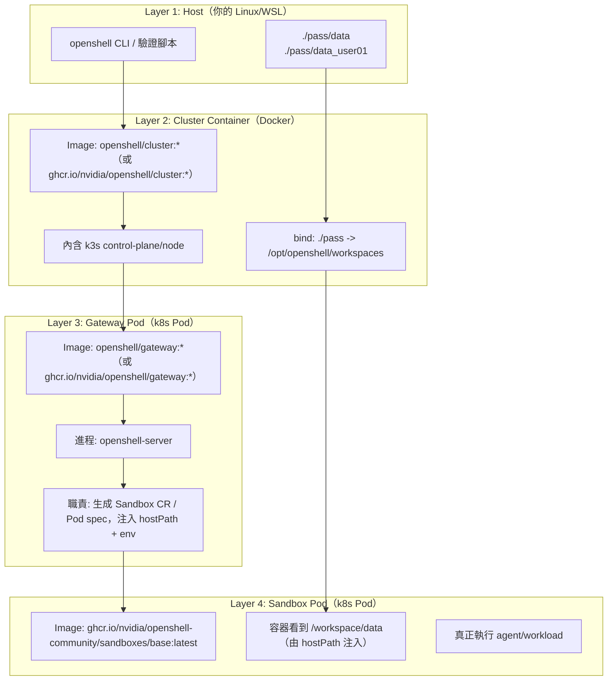

# OpenShell 層級與 Image 對照說明

這份文件專門回答一個常見疑問：

> 為什麼我用兩層指令（`docker exec ...` + `kubectl exec ...`）就能看到 sandbox 內部？  
> 那 cluster / gateway / sandbox 到底怎麼分層？

---

## 1. 先講結論（TL;DR）

- 你看到的「兩層」其實是兩種不同控制面：
  - `docker exec ...`：進到 **cluster container**（k3s node 所在）
  - `kubectl exec ...`：透過 k8s API 進到 **pod container**（可能是 gateway pod，也可能是 sandbox pod）
- `kubectl exec` 能到哪個容器，取決於你指定的 pod 名稱，而不是固定等於 sandbox。
- 所以「可以兩步到內部」不代表層級被省略，而是你用管理工具跨層進入。

---

## 2. 層級總覽（由外到內）



---

## 3. 你那兩條指令，實際跨了哪些層

假設：

- `docker exec -it e4f7d37b65e9 bash`
- `kubectl -n openshell exec -it ocode-api -- bash`

### 第一步：`docker exec`

- 進入的是 **Layer 2（cluster container）**
- 這裡看到的是 k3s node 的檔案系統與工具（`kubectl`、manifests、/opt/openshell/...）
- 對應 image：`openshell/cluster:*`（或 ghcr registry 版本）

### 第二步：`kubectl exec`

- 是透過 k8s API 再進到某個 pod container（Layer 3 或 Layer 4）
- `ocode-api` 這個 pod 名稱在你環境可能是 gateway 或其他 app，不一定是 sandbox
- 要確認是否為 sandbox，請看：
  - pod labels / ownerReferences（是否由 `Sandbox` CR 擁有）
  - container env（是否有 `OPENSHELL_SANDBOX_*`）

---

## 4. 每一層的「作用」與「對應 image」

| 層級 | 主要作用 | 典型 image |
|---|---|---|
| Host | 存放真實資料、啟動 CLI 與驗證腳本 | N/A（主機環境） |
| Cluster Container | 承載 k3s node、接住 host bind、套用 HelmChart | `openshell/cluster:*` / `ghcr.io/nvidia/openshell/cluster:*` |
| Gateway Pod | 跑 `openshell-server`、把 mount 規則轉成 sandbox pod spec | `openshell/gateway:*` / `ghcr.io/nvidia/openshell/gateway:*` |
| Sandbox Pod | 真正跑 agent/workload，消費 `/workspace/data` | `ghcr.io/nvidia/openshell-community/sandboxes/base:latest` |

---

## 5. 常見混淆點

### 混淆 A：我進了 pod，就等於進了 sandbox？

不一定。你可能進的是 gateway pod（`openshell-server`），不是 sandbox pod。

### 混淆 B：`/workspace/data` 應該在 cluster image 裡？

不是。`/workspace/data` 是 sandbox pod runtime 時由 hostPath volume 注入，不是 cluster image baked-in 內容。

### 混淆 C：sandbox image 決定 mount 來源？

不是。sandbox image 決定「執行環境」；mount 來源由 gateway server 生成的 pod spec 決定。

---

## 6. 建議的定位順序（Debug Checklist）

- [ ] Host 層：`./pass/data*` 檔案存在且內容正確
- [ ] Cluster 層：`/opt/openshell/workspaces` 看得到對應資料
- [ ] Gateway 層：server pod env 有 `OPEN_SHELL_WORKSPACE_*`
- [ ] Sandbox CR 層：`spec.podTemplate.spec.volumes` 有 `openshell-workspace-data` hostPath
- [ ] Sandbox Pod 層：container `volumeMounts` 有 `/workspace/data`
- [ ] 內部驗證：`cat /workspace/data/...` 內容符合 datapath

---

## 7. 實際命令對照區（可直接貼上）

以下指令假設 gateway 名稱是 `openshell`，namespace 是 `openshell`。

### 7.1 Host 層（Layer 1）

確認來源資料在 host 正確：

```bash
ls -la ./pass/data ./pass/data_user01
cat ./pass/data/data.txt
cat ./pass/data_user01/data_user01.txt
```

---

### 7.2 Cluster 層（Layer 2）

確認 cluster container 在跑，且有把 host `./pass` 映射進去：

```bash
docker ps --filter name=openshell-cluster-openshell --format '{{.Names}}|{{.Image}}|{{.Status}}'
docker inspect openshell-cluster-openshell --format '{{json .HostConfig.Binds}}'
docker exec openshell-cluster-openshell sh -lc 'ls -la /opt/openshell/workspaces && ls -la /opt/openshell/workspaces/data && ls -la /opt/openshell/workspaces/data_user01'
```

---

### 7.3 Gateway 層（Layer 3）

確認 server pod image 與 workspace env 是否正確：

```bash
docker exec openshell-cluster-openshell sh -lc 'KUBECONFIG=/etc/rancher/k3s/k3s.yaml kubectl -n openshell get pod openshell-0 -o yaml | sed -n "/image:/,/imagePullPolicy:/p" | head -n 20'
docker exec openshell-cluster-openshell sh -lc 'KUBECONFIG=/etc/rancher/k3s/k3s.yaml kubectl -n openshell get pod openshell-0 -o yaml | sed -n "/OPEN_SHELL_WORKSPACE_BASE/,+10p"'
```

確認 cluster entrypoint 已把值寫入 HelmChart：

```bash
docker exec openshell-cluster-openshell sh -lc 'sed -n "24,70p" /var/lib/rancher/k3s/server/manifests/openshell-helmchart.yaml'
```

---

### 7.4 Sandbox CR / Pod 層（Layer 4）

建立可觀察用 sandbox（sleep）：

```bash
OPEN_SHELL_WORKSPACE_BASE=./pass \
OPEN_SHELL_WORKSPACE_USER=user01 \
OPEN_SHELL_WORKSPACE_USER_DATAPATH=data_user01 \
OPENSHELL_CLUSTER_IMAGE=openshell/cluster:dev \
OPENSHELL_PUSH_IMAGES=openshell/gateway:dev \
./target/debug/openshell sandbox create --name mount-debug --from ghcr.io/nvidia/openshell-community/sandboxes/base:latest --no-tty -- sh -lc 'sleep 300'
```

看 Sandbox CR 是否有 hostPath 注入：

```bash
docker exec openshell-cluster-openshell sh -lc 'KUBECONFIG=/etc/rancher/k3s/k3s.yaml kubectl -n openshell get sandbox mount-debug -o yaml | sed -n "/volumes:/,/status:/p"'
```

看 Sandbox Pod 是否有 `/workspace/data` mount：

```bash
docker exec openshell-cluster-openshell sh -lc 'KUBECONFIG=/etc/rancher/k3s/k3s.yaml kubectl -n openshell get pod mount-debug -o yaml | sed -n "/volumeMounts:/,/volumes:/p"'
```

進 sandbox pod 驗證最終資料：

```bash
docker exec openshell-cluster-openshell sh -lc 'KUBECONFIG=/etc/rancher/k3s/k3s.yaml kubectl -n openshell exec mount-debug -- sh -lc "ls -la /workspace/data && cat /workspace/data/data_user01.txt"'
```

清理：

```bash
./target/debug/openshell sandbox delete mount-debug
```

---

### 7.5 一次跑完整 mount validate（建議）

```bash
OPENSHELL_PUSH_IMAGES=openshell/gateway:dev \
OPENSHELL_BIN=./target/debug/openshell \
bash pass/openshell-mount-validate.sh \
  --skip-build \
  --skip-test \
  --skip-general-validate \
  --cluster-image openshell/cluster:dev \
  --recreate-gateway
```

完成後重點看：

```bash
ls -1 pass/artifacts | tail
# 進最新 mount-validation-*/ 查看 run.log / sandbox_a_dump.txt / sandbox_b_dump.txt
```

---

## 8. `openshell term` 區塊對照表

你在 `openshell term` 看到的內容屬於「控制面觀測」，不是直接 attach 某個 pod shell。  
下面是畫面區塊與 Kubernetes 物件的對照：

| `openshell term` 區塊 | 對應資源 | 是否 Pod | 主要用途 |
|---|---|---|---|
| `Gateways` | OpenShell Gateway 實例（由 CLI metadata + server 狀態彙整） | 間接對應 `openshell-0`（server pod） | 管理入口、顯示健康度、目前 endpoint |
| `Sandboxes` | `agents.x-k8s.io/v1alpha1` 的 `Sandbox` CR | 每個 Sandbox 會對應一個獨立 sandbox pod | 執行工作負載、隔離環境、掛載 `/workspace/data` |
| `Providers` | provider 設定（OpenShell 內部設定資料） | 否 | 推理/模型供應商連線設定 |

補充：

- `gateway` 與 `sandbox` 在執行面是不同 pod、不同責任。
- `openshell term` 是查詢與操作這些資源的 UI，不是直接進入 pod 互動 shell。
