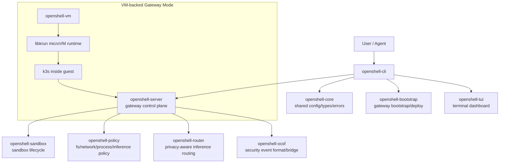
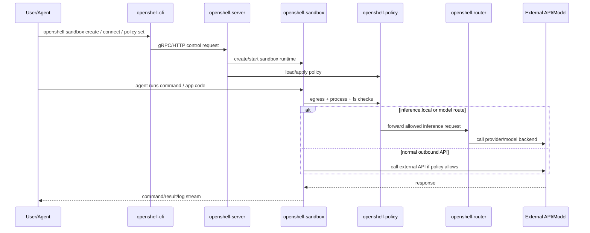

# OpenShell 呼叫路徑 Mermaid 圖（Python 工程師版）

> 目標：用「你會的 Python 心智模型」理解 OpenShell 在 Rust/Cargo workspace 中，從 CLI 到 Gateway/Sandbox/Policy/VM 的主要呼叫路徑。

## Top-down 總覽

OpenShell 的主路徑可以先拆成三層：

1. **入口層（CLI）**：你在終端輸入 `openshell ...`，由 `openshell-cli` 接命令與參數。  
2. **控制層（Gateway）**：`openshell-server` 負責控制面 API、狀態協調與生命週期管理。  
3. **執行與防護層（Sandbox + Policy + Router）**：`openshell-sandbox` 執行工作負載，`openshell-policy` 做限制，`openshell-router` 處理 inference routing。  

新版另有 **VM 執行模式**：透過 `openshell-vm` + `libkrun`，把 gateway 控制面放到 microVM 裡執行（更強隔離邊界）。

## 呼叫路徑（控制流）

## 呼叫路徑（資料流 / 請求流）

## Rust/Cargo 對 Python 對照（快速版）

- `crate`：類似一個 Python package。  
- `Cargo.toml`：類似 `pyproject.toml` + build/test/dependency 設定。  
- `Cargo workspace`：類似 monorepo 多 package 管理（共享依賴與規範）。  
- `openshell-cli`：類似 Python 的 `typer/click` 入口程式，但用 Rust 實作。  
- `openshell-core`：類似共用 `common/` package（型別、錯誤、設定）。  

## TODO（你接下來可以怎麼讀）

- [ ] 先從 `crates/openshell-cli` 看 command parsing 與入口流程。  
- [ ] 再看 `crates/openshell-server` 理解控制面責任邊界。  
- [ ] 接著看 `crates/openshell-sandbox` + `crates/openshell-policy` 對應執行限制。  
- [ ] 最後看 `crates/openshell-vm`，理解 microVM 模式與 `libkrun` 的整合點。  

