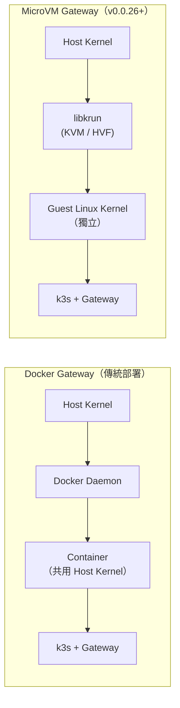
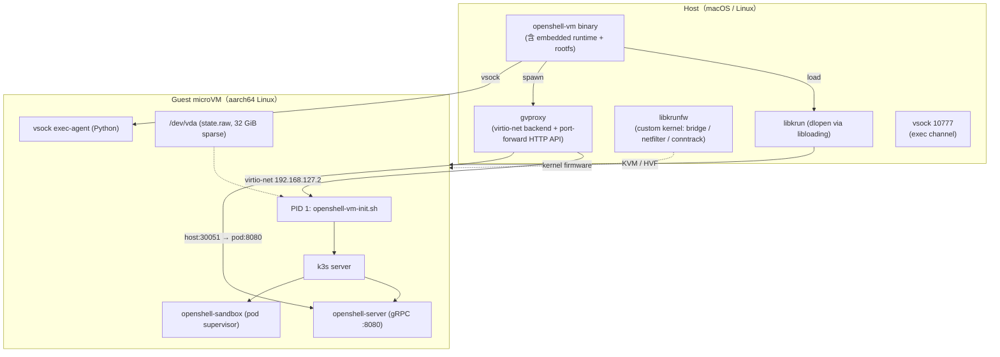

# openshell-vm vs Docker：完整對比與說明文件

> 版本範圍：v0.0.26 (2026-04-09) 引入 `openshell-vm` crate（PR #611）起，至當前 main 分支
> 適用讀者：OpenShell 維運 / Security / Platform 團隊
> 術語：MicroVM = 微虛擬機；Gateway = OpenShell 控制平面（server + sandbox）

---

## 1. Top-down Overview

`openshell-vm` 是 OpenShell 在 **v0.0.26** 版本中新增的 MicroVM runtime crate（`crates/openshell-vm/`），以 [libkrun](https://github.com/containers/libkrun) 為底層，在宿主機啟動一顆輕量級 aarch64 / x86_64 Linux microVM，**VM 內部再執行單節點 k3s**，承載 OpenShell gateway（`openshell-server` + `openshell-sandbox`）。

它不是取代 Docker 的「容器引擎」，而是**取代「以 Docker container 跑 k3s gateway」這一層部署方式**。兩者在隔離邊界、攻擊面、執行模型上有本質差異。



關鍵差異一句話：**Docker 共用宿主 kernel，MicroVM 攜帶獨立 guest kernel，攻擊面差數個量級**。

---

## 2. 為何 v0.0.26 要新增這項功能（Design Motivation）

v0.0.26 透過 [PR #611](https://github.com/NVIDIA/OpenShell/pull/611) 一次性引入 `openshell-vm`（+10,972 / −61 行，56 檔案，26 commits），是 v0.0.14 → v0.0.30 期間**最重大的架構變革**。動機可分為五個面向：

### 2.1 安全：提升隔離邊界至 VM 級別

| 現況（Docker Gateway） | 問題 |
|---|---|
| k3s / containerd 跑在 container 內 | 與 host 共用 kernel |
| CVE（container escape）直接威脅 host | 歷史上不乏 runc / containerd 逃逸案例 |
| sandbox pod 最終仍跑在同一個 host kernel | Landlock / seccomp 之外缺少 hypervisor 邊界 |

MicroVM 將 gateway 置於 hypervisor 邊界之後，攻擊者需先完成 **VM escape**（難度高於 container escape 數個量級）才能觸及 host。這與 OpenShell 四層防禦體系（Landlock / seccomp / Network namespace / Inference routing）疊加後形成**縱深防禦 (Defense in Depth)**。

### 2.2 依賴：消除 Docker daemon 作為 SPOF

Docker 在生產環境的痛點：

- Docker daemon 本身即為特權 (root) 常駐程序，是額外攻擊面與 SPOF（Single Point of Failure）
- `/var/run/docker.sock` 暴露等同於 root shell
- 企業環境日益傾向 **rootless / daemonless** 部署（podman、containerd、nerdctl）

`openshell-vm` 以嵌入式 runtime（libkrun + libkrunfw + gvproxy）打包為**單一 binary**，不依賴 Docker daemon，符合現代零信任部署趨勢。

### 2.3 平台：macOS 原生開發體驗

- Docker Desktop on macOS 需 license、耗資源、UX 不佳
- Apple `Hypervisor.framework` 為 Apple Silicon 原生支援（無需 root，需 entitlement codesign）
- 開發者可直接 `mise run vm` 在 Mac 上跑 gateway，無需 Docker Desktop

### 2.4 部署：單一 binary，自解壓

| 傳統 Docker | MicroVM |
|---|---|
| 安裝 Docker → pull image → 設定 volume → `docker run` | `curl install-vm.sh | sh` → 直接執行 |
| 多層依賴（daemon、image registry、network driver） | 單一 binary 內嵌 rootfs.tar.zst、libkrun、libkrunfw、gvproxy |

`install-vm.sh`（與 `install.sh` 對應）從 `vm-dev` GitHub Release 下載預建 binary；`openshell-vm` 首次啟動會把內嵌的 runtime 與 rootfs 自解壓到 `~/.local/share/openshell/openshell-vm/<version>/`。

### 2.5 Crash recovery 與狀態持久化

- `state.raw`（32 GiB sparse raw block image）作為 guest 的 `/dev/vda`，承載 k3s kine DB、containerd images、Helm releases
- `recover_corrupt_kine_db()` 於每次 boot 時檢查 SQLite header，發現損毀自動修復
- 這是 Docker volume 模型難以等價實現的（volume 是 host-side bind mount，缺乏 block-level 原子性）

---

## 3. 架構對比（Implementation Details）

### 3.1 執行模型



### 3.2 核心面向完整對比

| 面向 | Docker Gateway | MicroVM Gateway (`openshell-vm`) |
|---|---|---|
| **隔離邊界** | Container（namespace + cgroup），**共用 host kernel** | VM（hypervisor），**獨立 guest kernel** |
| **Hypervisor** | 無 | Linux: **KVM** (`/dev/kvm`) / macOS ARM64: **Hypervisor.framework** |
| **核心攻擊面** | Host kernel 全部 syscall 介面暴露 | Host kernel 僅透過 **virtio 介面**暴露（攻擊面小數個量級） |
| **特權需求** | Docker daemon 為 root 常駐；socket 等同 root shell | macOS: 一般使用者 + codesign entitlement<br/>Linux: `kvm` group（不需 root） |
| **啟動機制** | `docker run` → containerd → runc → namespace | `fork()` → `krun_start_enter()`（永不回傳），parent 監控 |
| **執行時相依** | Docker daemon + image cache + bridge network | libkrun + libkrunfw + gvproxy（**嵌入 binary 自解壓**） |
| **平台支援** | Linux / macOS (Docker Desktop) / Windows (WSL2) | Linux (KVM, aarch64+x86_64) / macOS ARM64 (HVF) |
| **網路** | Docker bridge / host / overlay | **gvproxy**（virtio-net backend, vfkit/QEMU mode）<br/>Guest 固定 IP `192.168.127.2`，DHCP |
| **Port forwarding** | `docker run -p H:G` iptables DNAT | gvproxy HTTP API `POST /services/forwarder/expose`（UNIX socket） |
| **檔案系統** | overlay2 + bind mount + volume | **virtio-fs**（rootfs 直掛）+ 32 GiB **sparse raw image**（state） |
| **狀態持久化** | Docker volume（host bind mount） | `state.raw` → guest `/dev/vda`（block-level，SQLite 自動修復） |
| **多實例** | 多 container，共用 daemon | `--name <n>`，每 instance 獨立 rootfs / state / socket / gvproxy |
| **主機控制通道** | `docker exec` 走 daemon API | **vsock port 10777**（不經 network，exec-agent 代理） |
| **資源配置** | `--cpus` / `--memory`（cgroup） | `--vcpus` / `--mem`（hypervisor，預設 4 vCPU / 8 GiB） |
| **冷啟動時間** | 秒級（image 已 pull） | **8 ms TCP 可達 / 14 s Ready**（full rootfs，參考 pass/artifacts benchmark） |
| **Image 更新** | `docker pull` → `docker run` | 重建 `rootfs.tar.zst` → 重編 binary（`include_bytes!` 嵌入） |
| **Crash recovery** | 需外部 orchestrator（compose/k8s） | `flock` 鎖定 + `recover_corrupt_kine_db()` 內建自癒 |
| **觀測性** | `docker logs` / `docker stats` | `--krun-log-level 0-5` / `console.log` / `OPENSHELL_VM_DIAG=1` |

### 3.3 Networking 後端細節

```
macOS  : openshell-vm → gvproxy (-listen-vfkit unixgram://)  → libkrun (krun_add_net_unixgram, SOCK_DGRAM + vfkit flag)
Linux  : openshell-vm → gvproxy (-listen-qemu  unix://)      → libkrun (krun_add_net_unixstream, SOCK_STREAM)
```

gvproxy 內部執行使用者態網路棧（gVisor netstack），提供：

1. Guest 透過 DHCP 取得固定 IP `192.168.127.2`
2. Host 透過 HTTP API 設定 TCP port expose（exponential backoff retry）
3. 不需要 host-side iptables / bridge 設定

相較 Docker bridge 模式，gvproxy 無需 `NET_ADMIN` capability，也不會污染 host 的 iptables chain。

### 3.4 `--net` 三種 backend

| Backend | 用途 | 限制 |
|---|---|---|
| `gvproxy`（預設） | 真實 eth0 + DHCP + port-forward | 需額外 gvproxy 行程 |
| `tsi` | libkrun 原生 Transparent Socket Impersonation | 攔截 loopback，**k3s 不適用** |
| `none` | 無網路 | 僅除錯 |

### 3.5 安全強化細節

| 機制 | 用途 |
|---|---|
| `secure_socket_base()` | 驗證 socket 目錄非 symlink、uid 一致（防 symlink attack） |
| `is_process_named()` | kill stale gvproxy 前以 `/proc/<pid>/comm` 驗證（防 PID reuse 誤殺） |
| `flock` on rootfs | OS 級獨佔鎖，SIGKILL 也會釋放；防止並行 boot / rebuild 衝突 |
| Runtime provenance logging | 啟動時記錄 libkrunfw SHA256、kernel version、build timestamp |
| Cert drift detection | Warm boot 比對 host/guest CA cert，差異時自動 re-sync |
| `KRUN_SYNC_RELAXED` (macOS) | HVF 效能考量；Linux 用 `KRUN_SYNC_FULL` |

---

## 4. 為何不直接用 Kata Containers / Firecracker？

| 方案 | 不採用原因 |
|---|---|
| Kata Containers | 需 Kubernetes runtime class 整合，部署複雜；目標為多租戶 K8s |
| Firecracker | AWS 主導，macOS 無原生支援；需自行打包 kernel + init |
| gVisor | 使用者態 kernel，syscall 相容性不完整；效能差 |
| **libkrun** | **macOS 原生 HVF + Linux KVM 雙平台 / 提供 FFI / krunvm 生態 / 輕量** |

libkrun 對 OpenShell 的獨特契合點：

1. **雙平台 FFI** — 同一份 Rust 程式碼可在 macOS（HVF）與 Linux（KVM）載入
2. **用 `dlopen` 動態載入** — 非 build-time linkage，runtime 可替換，便於發行打包
3. **virtio-fs 直掛目錄** — 不需轉 disk image，rootfs 與 host filesystem 語意一致
4. **自訂 kernel** — `libkrunfw` 可重新編譯以啟用 bridge / netfilter / conntrack（stock Homebrew 版沒有，pod 網路會失敗）

---

## 5. 生產環境適用性評估

### 5.1 正面影響

- **VM-level 隔離** — 獨立 guest kernel，VM escape 難度高
- **消除 Docker daemon** — 移除 SPOF 與額外攻擊面
- **macOS 原生** — 不需 Docker Desktop license
- **單一 binary** — 部署極簡化
- **Crash recovery** — state disk + kine DB 自癒
- **開發者友好** — `mise run vm` 一鍵啟動

### 5.2 限制與風險

| 項目 | 說明 | 緩解建議 |
|---|---|---|
| **Pre-release 狀態** | GitHub 標 `vm-dev`，尚未進穩定 release 線 | 開發 / 內部試跑，勿用於核心生產 |
| **KVM 依賴** | Cloud VM 需支援 nested virtualization | 選用 AWS `*.metal` / GCP nested VM |
| **資源開銷** | 預設 4 vCPU + 8 GiB RAM，遠大於 container | 用 `--vcpus / --mem` 依負載調整 |
| **不整合現有 K8s** | VM 內部自帶 k3s，與企業 K8s 為平行佈建 | 用於單機 edge / dev gateway |
| **Single-instance** | 無 HA、無 multi-node | 不適合高可用場景 |
| **gvproxy 可靠性** | orphan cleanup 依賴 PID file + port scan，非 100% 可靠 | `--reset` 清理；監控 stale process |
| **Rootfs 更新成本** | 改 rootfs 需重編 binary（`include_bytes!`） | 分離 runtime 與 rootfs 的 release pipeline |

### 5.3 適用場景決策表

| 場景 | 建議方案 |
|---|---|
| 企業 K8s cluster 多租戶 gateway | 繼續用 Docker / K8s 部署（搭配 OpenShell 既有 Landlock + seccomp + network policy） |
| 單機高安全 edge gateway | **MicroVM** ✅ |
| macOS 開發者本機 gateway | **MicroVM** ✅ |
| Windows（WSL2）環境 | Docker（WSL2 KVM 有效能與 nesting 限制） |
| CI / 短期驗證 | Docker（啟動快、資源小） |
| 需要審計級隔離（金融 / 醫療） | **MicroVM** ✅（搭配 hypervisor 邊界） |

---

## 6. 安裝與使用對照

### 6.1 Docker Gateway（傳統）

```bash
# 依賴：Docker daemon
curl -fsSL https://raw.githubusercontent.com/NVIDIA/OpenShell/main/install.sh | sh

openshell gateway start     # 透過 docker 拉 image、跑 container
```

### 6.2 MicroVM Gateway（v0.0.26+）

```bash
# 依賴：KVM (Linux) 或 HVF (macOS)
curl -fsSL https://raw.githubusercontent.com/NVIDIA/OpenShell/main/install-vm.sh | sh

openshell-vm                                   # 啟動 full gateway（k3s + server）
openshell-vm --name dev                        # 命名 instance，支援並行
openshell-vm --exec /bin/sh --vcpus 2 --mem 2048   # 輕量模式，跑自訂 process
openshell-vm exec -- ls /                      # 對 running VM 下指令（走 vsock）
openshell-vm prepare-rootfs                    # 僅解壓 rootfs
openshell-vm --reset                           # 清空 state disk
```

### 6.3 發行工件對照

| Docker | MicroVM |
|---|---|
| `ghcr.io/nvidia/openshell:<tag>` | `openshell-vm-<arch>-<os>.tar.gz`（self-extracting binary）<br/>`vm-runtime-<os>-<arch>.tar.zst`（runtime 另行發布） |

---

## 7. 效能參考（來自 `pass/artifacts/vm-benchmark-*`）

以 Linux x86_64、16 core、16 GB RAM 為例：

| 指標 | 值 |
|---|---|
| Cold boot TCP `:30051` 可達 | 8 ms |
| Cold boot stderr `Ready` | 14.1 s |
| Warm boot TCP 可達 | 1.0 s |
| Warm boot `Ready` | 7.1 s |
| `kubectl run` → pod Running | 34.6 s |
| `kubectl exec` | 958 ms |
| Host `openshell-vm` RSS | ~117 MB |
| Guest mem used（steady） | 311 MB / 7966 MB |

這比 Docker container 冷啟動慢約 10×，但 **warm boot 已接近 container 等級**。對於 gateway 這種「啟動一次、長期運行」的工作負載，延遲差異可忽略。

---

## 8. 結論

`openshell-vm` 不是用來取代 Docker 作為容器 runtime，而是**以 hypervisor 邊界取代容器邊界**的 gateway 部署模型。v0.0.26 引入這項能力，是為了：

1. **縱深防禦** — 在既有 Landlock + seccomp + network policy 之上，補齊 VM 級別隔離
2. **消除 Docker daemon 依賴** — 單一 binary、零 daemon、免 root
3. **macOS 原生開發體驗** — 擺脫 Docker Desktop
4. **可審計的狀態持久化** — state disk + kine 自癒
5. **為 enterprise / edge deployment 提供另一條選項** — 不強制遷移 K8s 基礎建設

在選擇時，請依「隔離需求」「平台」「資源預算」三個維度決策：

- 需要最高隔離 / 單機 / 有 KVM 或 HVF → MicroVM
- 多租戶 K8s 生產環境 → 維持 Docker / K8s + sandbox 四層防禦
- Windows / CI → Docker

---

## 9. 延伸閱讀

- Code：`crates/openshell-vm/src/lib.rs`（核心 launch 流程）、`crates/openshell-vm/src/ffi.rs`（libkrun FFI）
- README：`crates/openshell-vm/README.md` / `crates/openshell-vm/runtime/README.md`
- PR：[#611 feat(vm): add openshell-vm crate with libkrun microVM gateway](https://github.com/NVIDIA/OpenShell/pull/611)
- 相關 PR：#788（release pipeline + install-vm.sh）、#806（build-libkrun.sh 強化）、#843（git describe 排除 `vm-dev` tag）
- Test script：`pass/test-openshell-vm.sh`
