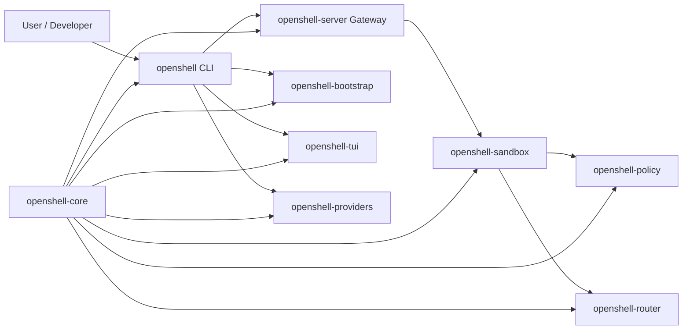

# OpenShell 專案架構速覽（Quickstart）

> 目標：讓新進開發者在 30 分鐘內掌握專案全貌、核心元件責任與閱讀順序。  
> 範圍：`D:\_Code\_GitHub\OpenShell-260324`

## 1) Top-down 架構總覽

- 本專案是 **Rust workspace + Python 包裝層** 的混合架構：核心功能在 `crates/*`，Python 主要負責發佈與部分 SDK 介面。
- 使用者主要從 `openshell` CLI 進入；CLI 會驅動 Gateway（控制面）與 Sandbox（執行面）協作。
- 核心共用能力集中在 `openshell-core`（設定、錯誤、proto、版本等），多個 crate 共同依賴。
- 安全能力由 policy 系統與 router/inference 相關模組提供，並透過 YAML policy 套用。
- 建置與日常開發流程以 `mise` + `tasks/*.toml` 為主；CI 在 `.github/workflows`。
- 文件與 agent-first 工作流在本專案佔比高，`architecture/`、`docs/`、`.agents/skills/` 都是理解專案的重要入口。

## 2) 核心元件關係（概念圖）

## 3) 目錄用途總表（第一層）

| 目錄 | 用途 |
| --- | --- |
| `crates/` | Rust 主程式碼（CLI、Gateway、Sandbox、Policy、Router、TUI 等） |
| `python/` | Python 套件與測試（`openshell` Python package） |
| `proto/` | Protobuf/gRPC 介面契約（`openshell.proto`、`sandbox.proto`、`inference.proto` 等） |
| `deploy/` | 部署相關檔案（Docker、Helm、K8s、SBOM scripts） |
| `tasks/` | `mise` 任務定義（build/lint/test/e2e/docs/release） |
| `.github/workflows/` | CI/CD 與自動化流程（PR 檢查、E2E、release、docs） |
| `e2e/` | 端對端測試（Rust、Python、install script） |
| `docs/` | 對外使用文件（Sphinx/MyST） |
| `architecture/` | 系統架構與設計說明文件（控制面/資料面/推論路由等） |
| `.agents/skills/` | Agent Skills（triage、spike、build、debug、PR 等工作流） |
| `examples/` | 教學與範例（policy、local inference、BYOC、quickstart） |
| `scripts/` | 開發/發佈輔助腳本 |
| `pass/` | 實驗記錄、PoC 與內部分析文件（包含本文件） |

## 4) `crates/` 子模組用途（重點）

| crate | 角色 |
| --- | --- |
| `openshell-cli` | 使用者主要入口；命令列介面（sandbox/gateway/provider/policy/term 等） |
| `openshell-server` | Gateway 控制面；管理 sandbox lifecycle、控制 API 與協調流程 |
| `openshell-sandbox` | Sandbox 執行面；負責隔離環境中的執行與網路策略落地 |
| `openshell-core` | 共用核心庫（config/error/proto/version 等） |
| `openshell-policy` | Policy 解析與執行（檔案/網路/程序/推論相關規則） |
| `openshell-router` | 流量路由與推論路由相關能力 |
| `openshell-providers` | Provider/credential 相關處理 |
| `openshell-bootstrap` | 環境引導與啟動前置流程 |
| `openshell-tui` | Terminal UI（`openshell term`） |
| `openshell-ocsf` | OCSF（Open Cybersecurity Schema Framework）相關能力 |

## 5) 技術棧與工程化配置

- **主要語言**：Rust（核心）、Python（包裝與部分測試/工具）。
- **建置**：
  - Rust workspace：`Cargo.toml`
  - Python build backend：`pyproject.toml`（`maturin`）
  - 任務執行：`mise.toml` + `tasks/*.toml`
- **測試**：
  - 單元/整合測試：Rust `cargo test --workspace`
  - Python 測試：`pytest`
  - 系統級測試：`e2e/`（Rust + Python lanes）
- **CI/CD**：`.github/workflows/`（重點：`branch-checks.yml`、`e2e-test.yml`）

## 6) 典型執行流程（從 CLI 到 Sandbox）

1. 開發者執行 `openshell sandbox create ...`。  
2. CLI 檢查/啟動 Gateway 與必要基礎設施（必要時 bootstrap）。  
3. Gateway 協調建立 Sandbox 執行環境。  
4. Sandbox 套用 policy，並透過 router 控制對外網路與推論路徑。  
5. 後續可透過 `openshell policy set` 等命令對動態策略進行更新。  

## 7) 新手 30 分鐘閱讀路徑（建議）

### 0-10 分鐘：建立心智模型

- `README.md`：產品定位、Quickstart、主要概念
- `architecture/README.md`：架構總覽與分層關係

### 10-20 分鐘：看入口與控制流程

- `crates/openshell-cli/src/main.rs`：CLI 命令樹與入口
- `crates/openshell-server/src/main.rs`、`crates/openshell-server/src/lib.rs`：Gateway 啟動與主要流程
- `crates/openshell-sandbox/src/main.rs`：Sandbox 入口

### 20-30 分鐘：看契約與工程流程

- `crates/openshell-core/src/lib.rs`、`crates/openshell-core/build.rs`：共用能力與 proto build
- `proto/openshell.proto`（及其他 proto）：跨元件契約
- `mise.toml`、`tasks/ci.toml`、`tasks/test.toml`：實際開發/CI 命令

## 8) 快速上手 TO-DO List

- [ ] 執行 `mise tasks`，先看任務分群（build/test/e2e/docs/release）
- [ ] 執行 `openshell --help`、`openshell gateway --help` 對照 CLI 命令層級
- [ ] 閱讀 `architecture/gateway.md` 與 `architecture/sandbox.md`，釐清控制面/資料面
- [ ] 跑一次最小測試：`mise run test`（至少確認本機開發環境可運作）
- [ ] 選一條 E2E 測試（`e2e/python` 或 `e2e/rust`）完整追一次

## 9) 常見閱讀迷路點（建議先避免）

- 先不要從單一 crate 深挖到底，先把 `CLI -> Gateway -> Sandbox -> Policy/Router` 主流程串起來。
- `docs/` 與 `architecture/` 的定位不同：前者偏使用教學，後者偏系統設計。
- `.agents/skills/` 不是一般產品程式碼，但對本專案貢獻流程非常關鍵。
