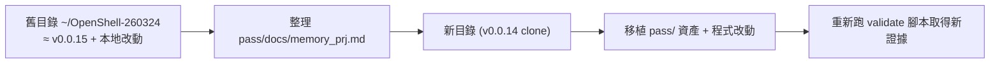

# 專案記憶交接 (memory_prj.md)

> 目的：讓新專案目錄（重新 clone 的 OpenShell v0.0.14）能完整繼承本目錄（`/home/chad/OpenShell-260324`，現況 ≈ v0.0.15）所做過的所有改動、驗證資產、設計決策與待辦事項。
>
> 產生日期：2026-04-17
> 來源：整併 `pass/docs/*.md` 與 `pass/cursor/*.plan.md` 歷史紀錄

---

## 0. Top-down 快速定位

- **專案定位**：Rust workspace + Python 包裝層。核心路徑 `CLI → Gateway (openshell-server) → Sandbox (openshell-sandbox) → Policy / Router`。
- **本目錄版本**：HEAD = `f37b69b`（屬 v0.0.15，約 346 commits）。未升級至 upstream v0.0.30（落後 13 個 release、≈ 83 commits）。
- **目標**：將以下四大工作流移植到新版 v0.0.14 目錄並重新驗證：
  1. `per-user workspace mount` 機制
  2. 禁 TLS Phase 1 POC（Ollama / OpenAI-compatible chat-only）
  3. OpenShell 操作 runbook + 驗證矩陣 + 評分體系
  4. Policy 測試矩陣與自動化腳本



---

## 1. 已完成的程式修改（必移植）

### 1.1 per-user workspace mount（核心改動）

| 檔案 | 變更要點 |
|------|---------|
| `crates/openshell-bootstrap/src/docker.rs` | 新增 `resolve_workspace_data_bind()`，在 cluster container 加入 bind：`<host_base>:/opt/openshell/workspaces`；讀取 `OPEN_SHELL_WORKSPACE_BASE`。 |
| `crates/openshell-server/src/sandbox/mod.rs` | 新增 `resolve_workspace_host_path()`：**不做 canonicalize/stat**，改以「`BASE` 必須 absolute、`DATAPATH` 必須 relative 且禁止 traversal」的 node-path 安全模型。`apply_workspace_mount()` 注入 `volumes.hostPath` + `volumeMount=/workspace/data`。 |
| `crates/openshell-server/src/sandbox/mod.rs` | 路徑解析優先序：`${BASE}/${USER_DATAPATH}` → `${BASE}/${USER}_data` → `${BASE}/data`。 |
| `deploy/kube/manifests/openshell-helmchart.yaml` | 新增 `workspaceBase` / `workspaceUser` / `workspaceUserDatapath` 三個 placeholders。 |
| `deploy/docker/cluster-entrypoint.sh` | 新增 `OPEN_SHELL_WORKSPACE_*` env 的 placeholder 取代與清空邏輯。 |
| `deploy/helm/openshell/values.yaml` | 新增 `server.workspaceBase` / `workspaceUser` / `workspaceUserDatapath`。 |
| `deploy/helm/openshell/templates/statefulset.yaml` | 把 values 渲染成 server pod env。 |

> 關鍵原因：server container 內看不到 k3s node filesystem（`/opt/openshell/workspaces/...`），在 server 端做 `canonicalize` 會誤判失敗，因此改為純安全檢查 + 直接組合 path。

### 1.2 禁 TLS Phase 1 POC

| 檔案 | 變更要點 |
|------|---------|
| `crates/openshell-sandbox/src/l7/inference.rs` | `default_patterns()` 依 `OPENSHELL_INFERENCE_CHAT_ONLY` 切換 chat-only 白名單（只允許 `POST /v1/chat/completions`，其他 `/v1/responses` 等回 403）。附單元測試。 |
| `crates/openshell-providers/src/providers/` | 新增 `ollama` provider type；credential key source 可用 `OLLAMA_API_KEY` / `API_KEY`。 |
| `crates/openshell-server/src/inference/` | `ollama` profile 驗證流程（`api-key` header、`OPENAI_BASE_URL`）。 |
| 安全強化 | 剝除 client 端 `api-key`（避免 header override route 端金鑰，僅 TCB 注入）。 |

### 1.3 Python proto task CRLF 修正

| 檔案 | 變更要點 |
|------|---------|
| `tasks/python.toml` | `python:proto` 改為執行 Python 腳本（避免 bash heredoc 被 CRLF 毀掉）。 |
| `tasks/scripts/python_proto.py`（新增）| 取代原 bash heredoc，做 `grpc_tools.protoc` 與 import rewrite。 |

### 1.4 測試穩定性放寬（WSL / 受限環境）

| 檔案 | 變更要點 |
|------|---------|
| `crates/openshell-sandbox/src/process.rs` | `drop_privileges_succeeds_for_current_user` 若錯誤為 `EPERM / permission denied / operation not permitted`，視為環境限制可接受；其他錯誤仍 fail。 |

---

## 2. `pass/` 目錄資產清單（必移植）

### 2.1 腳本（可執行 / 驗證用）

| 檔案 | 用途 | 狀態 |
|------|------|------|
| `pass/openshell-validate.sh` | 一般驗證（sandbox lifecycle + 檔案傳遞 + opencode serve + QA policy）。 | 已收斂 |
| `pass/openshell-mount-validate.sh` | per-user workspace mount 驗證（A/B dump、symlink 重指測試、artifact 保存）。 | 已強化：遇錯即停、dump 非空檢查、TLS flake 重試、`OPENSHELL_BIN` 指定本機 CLI |
| `pass/validate-policy-matrix.sh` | Policy 類型矩陣測試（c01~c12）+ Markdown 報告。 | 已可 continue-all |
| `pass/validate-qa-realtime-policy.sh` | QA realtime policy 案例。 | 已可用 |
| `pass/phase1-inference-probe.sh` | Phase 1 inference probe（chat/completions=200、responses=403）+ timing 指標。 | 已可用 |
| `pass/phase1-smoke.ps1` | Windows 版 smoke test（若仍需）。 | - |
| `pass/setup-ocode-api.sh` | OpenCode serve + forward 建置。 | - |
| `pass/extract-l7-denies.sh` | 從 logs 抽 L7 deny 事件。 | - |
| `pass/delete-all-sandboxes.sh` | 快速清理。 | - |

### 2.2 Policy / 資料

| 檔案 | 用途 |
|------|------|
| `pass/qa-realtime-policy.yaml` | 示範 QA 即時 policy。 |
| `pass/data/data.txt` | 驗證預設 `/workspace/data` 來源（內容：`this is data dir`）。 |
| `pass/data_user01/data_user01.txt` | 驗證 `user01` datapath（內容：`this is data_user01 dir`）。 |
| `pass/data_user02/data_user02.txt` | 驗證 symlink 重指至 user02（內容：`this is data_user02 dir`）。 |
| `pass/slk_data` → `data`（symlink） | symlink 版 datapath（相對目標、腳本啟動時建立）。 |
| `pass/slk_dataUser01` → `data_user01`（symlink） | 腳本執行中會動態重指到 `data_user02` 做 re-dump 驗證，EXIT trap 還原。 |

### 2.3 Artifacts（歷次驗證證據）

```
pass/artifacts/
├── mount-validation-20260409T064149Z/    # 早期 mount 驗證
├── mount-validation-20260415T072622Z/    # 最新 mount 驗證（含 symlink 重指）
├── mount-debug-sandbox/                   # 臨時 debug
├── openshell-validation-20260331T103620Z/ # 一般驗證
├── openshell-validation-20260401T095528Z/
├── openshell-validation-20260402T084608Z/
├── openshell-validation-20260407T075053Z/
├── policy-validation-20260401T093456Z/
└── policy-validation-20260416t100522z/    # 最新 policy 矩陣驗證
```

### 2.4 文件（pass/docs）

**核心交接**：

- `memory-260407.md`：2026-04-07 的工作收尾記憶（per-user mount、CRLF 修正、測試放寬）。
- `memory_prj.md`（本文件）：2026-04-17 全面整併版。
- `MEMORY-shared-warm-pool-late-binding.md`：Shared warm pool + late binding 的 SLO 規劃（P50/P95/P99 + warm pool hit rate ≥ 95%）。

**版本差異**：

- `openshell-v014-v030-summary.md`：簡潔版差異摘要。
- `openshell-v014-v030-full-report.md`：完整 v0.0.14 → v0.0.30 差異分析（含 MicroVM、Landlock、seccomp、OCSF、ComputeDriver）。

**操作與驗證**：

- `openshell-sandbox-runbook.md`：本機 sandbox 操作標準流程。
- `openshell-validation-matrix.md`：檔案傳遞 / OpenCode serve / Dispatcher 對接驗證矩陣。
- `openshell-handbook-and-automation.md`：runbook + 矩陣 + scorecard 整併。
- `openshell-expert-scorecard.md`：頂尖人士評分體系（L1–L4 + SLO + Error Budget）。
- `opencode-minimal-api-smoke-test.md`：OpenCode serve 最小 API smoke test（curl 版）。
- `openshell-call-path-mermaid.md`：CLI→Gateway→Sandbox 呼叫路徑 mermaid（Python 工程師版）。

**Mount / Workspace**：

- `mount-change-validation-guide.md`：mount 變更與驗證指南（含洋蔥圈架構圖、image 責任切分、tag 規範）。
- `per-user-workspace-mount.md`：per-user workspace mount 簡要說明。
- `layered-runtime-explainer.md`：Host / Cluster / Gateway / Sandbox 四層架構與實際 `docker exec` + `kubectl exec` 對照。

**Policy / POC**：

- `policy-test-cases.md`：Policy 測試案例清單（c01–c12）。
- `poc-no-tls-internal-network.md`：禁 TLS 內網完整 POC 文件（Phase 1/2、`api-key` 風險、loopback 例外）。

**容量 / SLO**：

- `capacity-estimation-template.md`：Little's Law 容量估算模板（pool_min / pool_target / pool_max）。

**專案導讀**：

- `project-architecture-quickstart.md`：30 分鐘架構速覽。
- `project-latest-status.md`：專案最新狀態（2026-03-27 收尾版）。
- `PROJECT_DOCUMENT_GUIDE.md`：全量文件導航。
- `PROJECT_DOCUMENT_GUIDE_v2_ROLE_BASED.md`：依 Developer / Ops / Security 角色導讀。
- `PROJECT_DOCUMENT_GUIDE_v3_SECURITY_MIN15_90MIN.md`：Security 15 份必讀 + 90 分鐘上手。
- `AGENT_INFRA_GUIDE.md`：agent-first 基礎設施導讀。

### 2.5 Cursor 對話備份（pass/cursor）

> 保留歷次 Cursor session 的完整對話與 plan 檔案，新專案遇到同類問題可直接 grep 參照。

**重要 plan 檔（放在最前面繼承）**：

- `per-user-mount-design_aaeef645.plan.md`：per-user mount 原始設計。
- `mount-validate_symlink_flow_eebffd07.plan.md`：symlink 流程與動態重指驗證設計。
- `openshell-sandbox-operational-plan_16606f28.plan.md`：sandbox 操作與驗證計畫。
- `openshell-python-api-wrapper_e60e8fbb.plan.md`：Python SDK → FastAPI HTTP/REST 包裝方案。
- `openshell_multi-tenant_workspace_on_s3_77aaaa8c.plan.md`：MinIO/S3 多租戶 workspace 評估。
- `policy-test-script_7e446c75.plan.md`：policy 測試矩陣腳本設計。
- `sandbox-pvc-mount_31444910.plan.md`：K8s PVC mount workspace 方案。
- `openshell_版本差異分析_4371cbe3.plan.md`：v0.0.14→v0.0.30 差異分析 plan。

---

## 3. 關鍵設計決策（移植時不可遺漏）

### 3.1 workspace hostPath 安全策略（v2：不做 canonicalize）

原因：k3s node filesystem 路徑在 server container 內不保證可 `stat`。改成三條靜態檢查：

1. `OPEN_SHELL_WORKSPACE_BASE` 必須 absolute。
2. `OPEN_SHELL_WORKSPACE_USER_DATAPATH` 必須 relative。
3. 禁止 `..` 及前綴 traversal（只接受 `Component::Normal`）。

通過後直接 `base.join(datapath)`，不做 fs 存取。

### 3.2 Image 變更責任切分

| Image | 來源 | 典型變更 | 影響面 |
|-------|------|---------|--------|
| `gateway`（`openshell/gateway:*` 或 `ghcr.io/nvidia/openshell/gateway:*`）| `openshell-server/*` + `deploy/helm/openshell/templates/statefulset.yaml` | server mount 決策、env 傳遞 | sandbox 能否把 hostPath 掛到 `/workspace/data` |
| `cluster`（`openshell/cluster:*` 或 `ghcr.io/nvidia/openshell/cluster:*`）| `deploy/docker/cluster-entrypoint.sh` + `deploy/kube/manifests/openshell-helmchart.yaml` | entrypoint 把 env 寫進 HelmChart valuesContent | server pod 是否吃到預期 env |

**驗證鐵律**：gateway 或 cluster 任一有改，都要遞增流水號 tag（例：`mv-0007`），且同一輪驗證兩個 image 共用同一號碼。

### 3.3 禁 TLS POC 的可證明範圍

- **能證明**：egress 只到允許端點（fail-closed、不可繞過）+ 可稽核。
- **不能證明**：跨節點 / 跨網段傳輸機密性（沒 TLS 就沒辦法）。
- **替代控制**：若要補完整性/身分，用 HMAC/Ed25519 請求簽章、短效 token；不補則須明確聲明範圍。

### 3.4 SLO 第一版（shared warm pool + late binding）

- `P50 sandbox startup < 1.5s`
- `P95 sandbox startup < 3.0s`
- `P99 sandbox startup < 6.0s`
- `warm pool hit rate ≥ 95%`
- `late binding (path + mount + auth) ≤ 1.5s @ P95`
- 預設 warm pool：**500**（依流量自動擴縮，非固定上限）。

---

## 4. 關鍵環境變數

| 變數 | 用途 | 範例 |
|------|------|------|
| `OPEN_SHELL_WORKSPACE_BASE` | workspace 根目錄（host 端） | `./pass` |
| `OPEN_SHELL_WORKSPACE_USER` | 使用者識別（fallback 用） | `user01` |
| `OPEN_SHELL_WORKSPACE_USER_DATAPATH` | 明確指定 datapath | `data_user01` 或 `slk_dataUser01` |
| `OPEN_SHELL_K3S_DATA_HOST_PATH` | 覆寫 k3s data named volume 為 bind mount（可選） | - |
| `OPENSHELL_INFERENCE_CHAT_ONLY` | Phase 1 chat-only 白名單開關 | `true` |
| `OPENSHELL_BIN` | 指定本機 CLI binary（避免用到舊 `~/.local/bin/openshell`） | `./target/debug/openshell` |
| `OPENSHELL_PUSH_IMAGES` | mount-validate 重建時推送的 gateway image tag | `openshell/gateway:dev` |
| `OPENSHELL_CLUSTER_IMAGE` | mount-validate 指定 cluster image | `openshell/cluster:dev` |
| `OPENSHELL_SANDBOX_IMAGE` | 指定 sandbox image（若預設 pull 失敗） | `ghcr.io/nvidia/openshell-community/sandboxes/base:latest` |
| `OPENAI_BASE_URL` | Ollama provider base URL | `http://192.168.31.180:11434/v1` 或 `http://host.openshell.internal:11434/v1` |
| `OLLAMA_API_KEY` / `API_KEY` | Ollama credential key source | - |
| `OPENSHELL_GATEWAY` | Python SDK 選 cluster 用 | `local` |

---

## 5. 最新驗證狀態

### 5.1 mount 驗證（2026-04-15T07:26Z）

- 目錄：`pass/artifacts/mount-validation-20260415T072622Z/`
- 已跑完：`run.log`、`build_cluster_image_*`、`gateway_destroy_*`、`gateway_image_probe.txt`、`gateway_start_*`、`sandbox_a_dump.txt`、`sandbox_b_dump.txt`、`sandbox_a_data_user01_after_retarget.txt`、`sandbox_a_data_user02.txt`。
- 結論：`DATAPATH_A=slk_dataUser01` / `DATAPATH_B=slk_data` 兩份 dump 明確區分；symlink 重指對已建立 sandbox 的影響行為已以 `sandbox_a_redump` 驗證。

### 5.2 policy 驗證（2026-04-16T10:05Z）

- 目錄：`pass/artifacts/policy-validation-20260416t100522z/`
- 有：`policy-validation-report.md`、`raw/`、`policies/`。
- 來源：`pass/validate-policy-matrix.sh` 驅動 `pass/policy-test-cases.md`（c01~c12）。

### 5.3 仍有疑慮的項目

- `mount-validation-20260407T101050Z/sandbox_a_dump.txt` / `sandbox_b_dump.txt` 為空（當時腳本用了不支援的 `sandbox exec`）。腳本已修正，需重跑取得有效結果。
- Phase 1：`/v1/responses` 預期 403 的驗證，需確認 gateway 啟動時有注入 `OPENSHELL_INFERENCE_CHAT_ONLY=true`。

---

## 6. 新專案目錄移植 TO-DO（Implementation Plan）

### 6.1 初始化（新專案目錄）

- [ ] 從 GitHub clone v0.0.14（NVIDIA/OpenShell）到新目錄（例：`~/OpenShell-v014`）。
- [ ] 驗證 clone 成功：`git describe --tags`（應顯示 `v0.0.14` 或接近）。
- [ ] 本目錄 commit 所有變更（或至少產生 diff）：
  - `git diff HEAD --stat` / `git diff HEAD > ~/openshell-local-changes.patch`
  - 或以 cherry-pick 方式挑選 commit。

### 6.2 程式改動移植

- [ ] 套用 per-user workspace mount 的六個檔案變更（§1.1）。
  - [ ] `crates/openshell-bootstrap/src/docker.rs`
  - [ ] `crates/openshell-server/src/sandbox/mod.rs`
  - [ ] `deploy/kube/manifests/openshell-helmchart.yaml`
  - [ ] `deploy/docker/cluster-entrypoint.sh`
  - [ ] `deploy/helm/openshell/values.yaml`
  - [ ] `deploy/helm/openshell/templates/statefulset.yaml`
- [ ] 套用 Phase 1 POC 改動（§1.2）：`openshell-sandbox/src/l7/inference.rs`、`openshell-providers`、`openshell-server/src/inference`。
- [ ] 套用 Python proto 修正（§1.3）：`tasks/python.toml` + `tasks/scripts/python_proto.py`。
- [ ] 套用測試放寬（§1.4）：`openshell-sandbox/src/process.rs`。

> 注意：v0.0.14 可能沒有部分檔案或函式名有差（v0.0.26 引入 `openshell-vm`、v0.0.30 引入 `ComputeDriver`），需用 patch context 比對，不要無腦套用。

### 6.3 pass/ 資產複製（無編譯風險）

- [ ] 整包複製 `pass/` 到新目錄：
  - `cp -a ~/OpenShell-260324/pass ~/OpenShell-v014/`
- [ ] 驗證 symlink 可用：
  - `ls -la pass/slk_data pass/slk_dataUser01`
  - `readlink pass/slk_data` 應為 `data`
  - `readlink pass/slk_dataUser01` 應為 `data_user01`
- [ ] 驗證資料檔：
  - `cat pass/data/data.txt` → `this is data dir`
  - `cat pass/data_user01/data_user01.txt` → `this is data_user01 dir`
  - `cat pass/data_user02/data_user02.txt` → `this is data_user02 dir`

### 6.4 新目錄重新編譯 + 驗證

- [ ] 編譯本機 CLI：`cargo build --bin openshell`（或 `mise run build`）。
- [ ] 跑 pre-commit：`mise run pre-commit`。
- [ ] 跑單測：`mise run test`。
- [ ] 跑 mount 驗證：
  ```bash
  OPENSHELL_PUSH_IMAGES=openshell/gateway:dev \
  OPENSHELL_BIN=./target/debug/openshell \
  bash pass/openshell-mount-validate.sh \
    --skip-build --skip-test --skip-general-validate \
    --cluster-image openshell/cluster:dev \
    --recreate-gateway
  ```
- [ ] 跑 policy 矩陣：`bash pass/validate-policy-matrix.sh`。
- [ ] 跑 Phase 1 probe：
  ```bash
  export OPENSHELL_INFERENCE_CHAT_ONLY=true
  bash pass/phase1-inference-probe.sh
  ```
- [ ] 比對新證據 vs `pass/artifacts/mount-validation-20260415T072622Z/` 與 `policy-validation-20260416t100522z/`。

### 6.5 升級評估（可選，依需求）

- [ ] 讀 `pass/docs/openshell-v014-v030-summary.md` 與 `openshell-v014-v030-full-report.md` 決定是否直接升 upstream。
- [ ] 若升版，注意影響本地改動的區域：
  - v0.0.22：gateway 狀態持久化、seccomp 強化、外部審計修復
  - v0.0.26：`openshell-vm`（libkrun microVM）引入
  - v0.0.29：Two-phase Landlock、seccomp denylist
  - v0.0.30：ComputeDriver 抽象、network deny rules

---

## 7. 下次會話建議首個動作

1. **確認新專案目錄已 clone v0.0.14** 並可進入。
2. **先做 §6.3（pass/ 複製）**：無編譯依賴、風險最低、可先讓 docs/scripts 在新目錄就緒。
3. **再做 §6.2（程式改動）**：一次套一個 crate、編譯一次、測試一次，避免大爆炸。
4. **最後跑 §6.4 全套驗證** 並保存新 artifact 作為「v0.0.14 基線」。

---

## 8. 風險與緩解

| 風險 | 機率 | 影響 | 緩解 |
|------|------|------|------|
| v0.0.14 與 v0.0.15 檔案佈局有差異（patch 失敗）| 中 | 中 | 使用 `git diff` + 手動逐檔套用，不要 `git apply --3way` 後直接 commit |
| 本地未升級留下已知 CVE（v0.0.22 修補的 13 項、v0.0.29 Landlock 失效）| 高 | 嚴重 | 評估直接升到 v0.0.30 而非停在 v0.0.14 |
| pass/ 腳本依賴特定 CLI flag 在 v0.0.14 不存在 | 中 | 低 | 以腳本 artifact log 對比行為差異，必要時以 `--no-tty` 等替代 |
| 新 clone 目錄 symlink 無法 commit 到 git | 低 | 低 | 腳本 `ensure_workspace_symlinks()` 在執行時自動建立 |

---

## 附錄 A：本目錄一頁速查

```
crates/
├── openshell-bootstrap/src/docker.rs       ← mount §1.1
├── openshell-server/src/sandbox/mod.rs     ← mount §1.1（核心）
├── openshell-sandbox/src/l7/inference.rs   ← Phase 1 §1.2
├── openshell-sandbox/src/process.rs        ← 測試放寬 §1.4
└── openshell-providers/src/providers/      ← ollama §1.2

deploy/
├── docker/cluster-entrypoint.sh            ← mount §1.1
├── kube/manifests/openshell-helmchart.yaml ← mount §1.1
└── helm/openshell/                         ← values + statefulset §1.1

tasks/
├── python.toml                             ← CRLF 修正 §1.3
└── scripts/python_proto.py                 ← CRLF 修正 §1.3

pass/
├── docs/memory_prj.md                      ← 本檔案
├── docs/memory-260407.md                   ← 歷史記憶
├── openshell-mount-validate.sh             ← mount 驗證
├── validate-policy-matrix.sh               ← policy 矩陣
├── phase1-inference-probe.sh               ← Phase 1 probe
├── openshell-validate.sh                   ← 一般驗證
├── data/ data_user01/ data_user02/         ← 驗證資料
├── slk_data → data, slk_dataUser01 → ...   ← symlink 測試
└── artifacts/                              ← 歷次證據
```

## 附錄 B：一條龍命令集（複製貼用）

```bash
# 準備環境變數
export OPEN_SHELL_WORKSPACE_BASE=./pass
export OPEN_SHELL_WORKSPACE_USER=user01
export OPEN_SHELL_WORKSPACE_USER_DATAPATH=data_user01
export OPENSHELL_INFERENCE_CHAT_ONLY=true
export OPENSHELL_BIN=./target/debug/openshell

# 編譯
cargo build --bin openshell

# 啟動 gateway（帶 workspace env）
$OPENSHELL_BIN gateway start

# 建 sandbox 驗證 mount
$OPENSHELL_BIN sandbox create --name mount-check \
  --from ghcr.io/nvidia/openshell-community/sandboxes/base:latest \
  --no-tty -- sh -lc 'cat /workspace/data/data_user01.txt'

# 清理
$OPENSHELL_BIN sandbox delete mount-check

# 跑完整 mount 驗證
OPENSHELL_PUSH_IMAGES=openshell/gateway:dev bash pass/openshell-mount-validate.sh \
  --skip-build --skip-test --skip-general-validate \
  --cluster-image openshell/cluster:dev --recreate-gateway

# 跑 policy 矩陣
bash pass/validate-policy-matrix.sh

# 跑 Phase 1 probe
bash pass/phase1-inference-probe.sh
```
