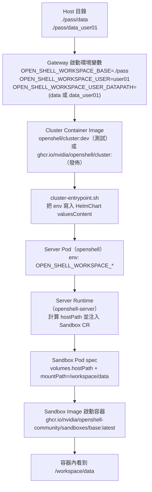
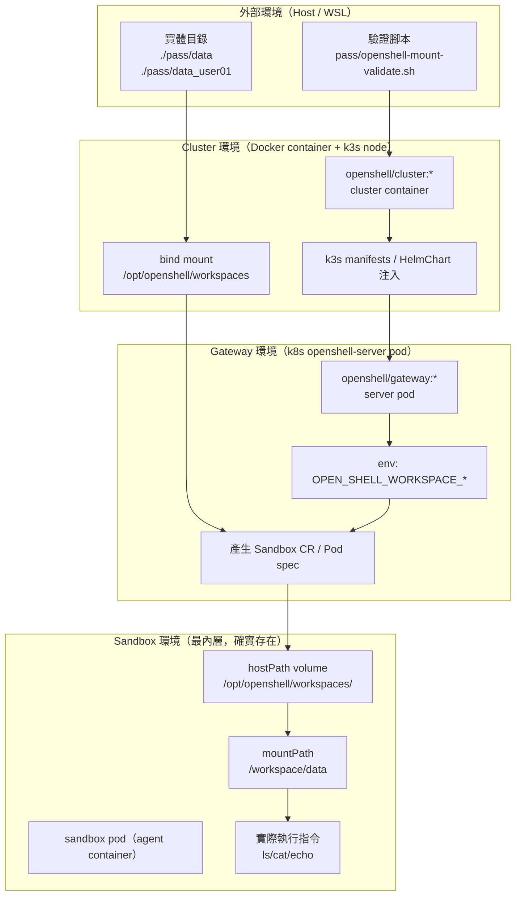

# OpenShell Mount 變更與驗證指南

本文件說明 per-user workspace mount 的最新實作與驗證流程，對齊目前 `pass/openshell-mount-validate.sh`。

## 1. mount 決策邏輯（Implementation Details）

在 sandbox 建立時，`/workspace/data` 對應來源依序決策：

1. `${OPEN_SHELL_WORKSPACE_BASE}/${OPEN_SHELL_WORKSPACE_USER_DATAPATH}`
2. `${OPEN_SHELL_WORKSPACE_BASE}/${OPEN_SHELL_WORKSPACE_USER}_data`
3. `${OPEN_SHELL_WORKSPACE_BASE}/data`

只要切換 `OPEN_SHELL_WORKSPACE_USER_DATAPATH`，就能在不改 policy 的情況下切換 `/workspace/data` 的實際來源。

### 1.1 `resolve_workspace_host_path()` 安全策略（最新）

在 `crates/openshell-server/src/sandbox/mod.rs`：

- 舊行為：會在 server container 內對 `OPEN_SHELL_WORKSPACE_BASE` 與候選 datapath 做 `canonicalize/stat`。
- 新行為：**不再**對 node path 做 `canonicalize/stat`，改成：
  - `OPEN_SHELL_WORKSPACE_BASE` 必須是 absolute path。
  - `OPEN_SHELL_WORKSPACE_USER_DATAPATH` 必須是 relative path。
  - 禁止 traversal / prefix（只接受 `Component::Normal`）。
  - 通過後直接組合 hostPath：`base.join(datapath)`。

原因：這個 path 是 **k3s node filesystem** 路徑（例如 `/opt/openshell/workspaces/...`），不保證在 server container 自身 namespace 內可 `stat` 到；若在 server 端硬做 `canonicalize` 會誤判失敗，導致 mount 注入被跳過。

### 1.2 mount 資料流示意圖（含 image）

`Sandbox Image` 的角色與作用：

- **提供執行環境**：shell、工具鏈、runtime、entrypoint。
- **不決定資料來源**：`/workspace/data` 的來源不是 image 內檔案，而是 server 注入的 hostPath volume。
- **可替換但行為一致**：你可以換 sandbox image（只要相容 supervisor），mount 來源仍由 server + hostPath 決定。
- **驗證意義**：若 `Sandbox Image` 啟得起來但 `DATA_DIR` missing，通常是 server pod spec 注入鏈路問題，不是 sandbox image 內容問題。

### 1.3 mount 架構示意圖（洋蔥圈）

層級說明（由外到內）：

- 第 1 層（Host）：你在本機看到的 `./pass/*` 真實資料來源。
- 第 2 層（Cluster）：`openshell/cluster` 這層把 Host 目錄映射到 node 路徑。
- 第 3 層（Gateway）：`openshell-server` 讀 env，決定要把哪個 datapath 注入 sandbox pod。
- 第 4 層（Sandbox）：最內層、確實存在；真正執行 agent/workload 的容器，透過 `/workspace/data` 看到外層資料。

## 2. 一條龍驗證步驟（TO-DO）

- [ ] 準備資料目錄
  - `pass/data/data.txt`
  - `pass/data_user01/data_user01.txt`
- [ ] 設定環境變數（可先照預設）
  - `export OPEN_SHELL_WORKSPACE_BASE=./pass`
  - `export OPEN_SHELL_WORKSPACE_USER=user01`
  - `export OPEN_SHELL_WORKSPACE_USER_DATAPATH_A=data_user01`
  - `export OPEN_SHELL_WORKSPACE_USER_DATAPATH_B=data`
- [ ] 執行完整驗證
  - 建議本機驗證（搭配本機 CLI binary）：
    - `OPENSHELL_PUSH_IMAGES=openshell/gateway:dev OPENSHELL_BIN=./target/debug/openshell bash pass/openshell-mount-validate.sh --skip-build --skip-test --skip-general-validate --cluster-image openshell/cluster:dev --recreate-gateway`
  - 若驗證發佈 tag：
    - `bash pass/openshell-mount-validate.sh --build-cluster-image --cluster-image ghcr.io/nvidia/openshell/cluster:<new-tag> --recreate-gateway`
  - 或使用自動 tag 模式：`bash pass/openshell-mount-validate.sh --auto-cluster-tag <new-tag> --recreate-gateway`
- [ ] 檢查 artifact 內容
  - `run.log`（流程是否中途失敗）
  - `build.txt`、`test.txt`、`build_cluster_image.txt`、`general_validate.txt`
  - `gateway_image_probe.txt`（啟動前後實際 gateway image/tag）
  - `sandbox_a_dump.txt`、`sandbox_b_dump.txt`
- [ ] 比對 mount 結果（強驗證）
  - `sandbox_a_dump.txt` / `sandbox_b_dump.txt` 不能完全相同
  - 兩份都必須包含 `DATA_DIR=/workspace/data`
  - `sandbox_a_dump.txt` 應對應 `data_user01`
  - `sandbox_b_dump.txt` 應對應 `data`

## 3. 常用執行模式

- 僅驗證 mount（略過 build/test/general validate）：
  - `bash pass/openshell-mount-validate.sh --skip-build --skip-test --skip-general-validate`
- 指定 CLI binary（避免用到舊版 `~/.local/bin/openshell`）：
  - `OPENSHELL_BIN=./target/debug/openshell bash pass/openshell-mount-validate.sh ...`
- 需要重建 gateway（套用新 env）：
  - `bash pass/openshell-mount-validate.sh --recreate-gateway`
- 重建 cluster image 並指定新的 gateway image tag：
  - `bash pass/openshell-mount-validate.sh --build-cluster-image --cluster-image ghcr.io/nvidia/openshell/cluster:<new-tag> --recreate-gateway`
- 自動設定 IMAGE_TAG + 改 tag + 套用 OPENSHELL_CLUSTER_IMAGE：
  - `bash pass/openshell-mount-validate.sh --auto-cluster-tag <new-tag> --recreate-gateway`
- 傳遞一般驗證參數給 `openshell-validate.sh`：
  - `bash pass/openshell-mount-validate.sh --general-validate-args "--skip-qa --skip-file-flow"`

## 4. 何時需要重建 image

- **需要重建**：你修改的是會進入執行中 runtime 的程式（例如 `openshell-server`、`openshell-bootstrap` 對容器行為的變更），且目前環境仍在使用舊 image。
- **可不重建**：只改文件、純腳本、或本機直接執行且不依賴舊 image 快取的流程。

實務上，mount 行為驗證若要有可信結果，建議至少重啟/重建 gateway（必要時重建並載入新 image）後再跑驗證。

## 5. Image 變更責任切分（重點）

為了正確驗證 `DATA_DIR` mount，請先分清楚哪類改動會落到哪個 image：

- `gateway image`（server/template 變更）
  - 內容來源：`deploy/helm/openshell/templates/statefulset.yaml`（server Pod env/template）、`crates/openshell-server/*`（server runtime 行為）
  - 原始名稱（registry）：`ghcr.io/nvidia/openshell/gateway:<tag>`
  - 測試時常用名稱（local）：`openshell/gateway:dev`
  - 典型變更：
    - 新增/修改 `OPEN_SHELL_WORKSPACE_BASE`
    - 新增/修改 `OPEN_SHELL_WORKSPACE_USER`
    - 新增/修改 `OPEN_SHELL_WORKSPACE_USER_DATAPATH`
    - server 端 mount 決策與 fallback 邏輯
  - 影響面：
    - Sandbox 建立時是否能把 host path 正確掛載到 `/workspace/data`
    - `OPEN_SHELL_WORKSPACE_USER_DATAPATH` 是否真的生效

- `cluster image`（entrypoint/helmchart 變更）
  - 內容來源：`deploy/docker/cluster-entrypoint.sh`、`deploy/kube/manifests/openshell-helmchart.yaml`
  - 原始名稱（registry）：`ghcr.io/nvidia/openshell/cluster:<tag>`
  - 測試時常用名稱（local）：`openshell/cluster:dev`
  - 典型變更：
    - entrypoint 將 gateway container env 注入 HelmChart `valuesContent`
    - Placeholder 取代規則（例如 `__XXX__`）
    - cluster 啟動時對 HelmChart 的 patch / sed 規則
  - 影響面：
    - gateway runtime 設定是否真的被帶到 k8s 的 server pod
    - 即使 `gateway image` 已更新，若這層沒更新仍可能吃到舊值

## 6. Tag 規範（流水號建議）

建議每次重建都使用「遞增流水號」的 tag，避免 `latest`/`dev` 判讀混亂。

- 命名建議
  - `gateway`: `ghcr.io/nvidia/openshell/gateway:mv-0001`
  - `cluster`: `ghcr.io/nvidia/openshell/cluster:mv-0001`
- 下一次重建改為 `mv-0002`，依序遞增。
- 原則：
  - **同一輪驗證**（gateway + cluster 配套）使用同一流水號。
  - **任一 image 有重建**就遞增一次，不覆寫舊號。

### 7.1 推薦執行順序（含 tag）

- [ ] 決定本輪流水號（例如 `mv-0007`）
- [ ] 重建 `gateway image`（server/template 變更）
- [ ] 重建 `cluster image`（entrypoint/helmchart 變更）
- [ ] 以 `--cluster-image ghcr.io/nvidia/openshell/cluster:mv-0007 --recreate-gateway` 啟動驗證
- [ ] 在 artifact 記錄本輪 tag（run.log + gateway image probe）

## 7. 環境與 image 版本釐清清單

開始 mount 驗證前，請至少確認：

- [ ] 目前 cluster container 實際 image/tag（`docker ps`）
- [ ] cluster 內 `openshell-helmchart.yaml` 已替換成預期值（非 placeholder）
- [ ] server pod env 已包含 `OPEN_SHELL_WORKSPACE_*`
- [ ] sandbox dump 中 `DATA_DIR` 不為 `<missing>`
- [ ] `sandbox_a_dump.txt` / `sandbox_b_dump.txt` 對應到不同 datapath 內容

## 8. 變更範圍（Top-down）

- `crates/openshell-bootstrap/src/docker.rs`
  - workspace bind 改為掛整個 base：`<host pass> -> /opt/openshell/workspaces`
  - 將 `OPEN_SHELL_WORKSPACE_BASE` 傳入 server 時轉成 node 端路徑：`/opt/openshell/workspaces`
  - 透過 container env 傳遞 `OPEN_SHELL_WORKSPACE_USER`、`OPEN_SHELL_WORKSPACE_USER_DATAPATH`
- `deploy/kube/manifests/openshell-helmchart.yaml`
  - 新增 `workspaceBase/workspaceUser/workspaceUserDatapath` placeholders
- `deploy/docker/cluster-entrypoint.sh`
  - 新增 `OPEN_SHELL_WORKSPACE_*` 取代與清空邏輯（placeholder -> values）
- `deploy/helm/openshell/values.yaml`
  - 新增 `server.workspaceBase/workspaceUser/workspaceUserDatapath` 欄位
- `deploy/helm/openshell/templates/statefulset.yaml`
  - 將上述 values 渲染成 server pod env（`OPEN_SHELL_WORKSPACE_*`）
- `crates/openshell-server/src/sandbox/mod.rs`
  - `resolve_workspace_host_path()` 改為 node-path 安全檢查模型（不在 server container 內做 canonicalize/stat）
  - `apply_workspace_mount()` 將 hostPath 注入 sandbox pod，並 mount 到 `/workspace/data`
- `pass/openshell-mount-validate.sh`
  - 新增 `OPENSHELL_BIN`（可指定本機新編譯 CLI）
  - gateway start 一律帶入 `OPEN_SHELL_WORKSPACE_*`（與可選 `OPENSHELL_PUSH_IMAGES`）
  - local `openshell/cluster:*` 情境下，每次 gateway recreate 前自動重建 cluster image
  - `DATA_DIR` 缺失即 fail；A/B dump 內容差異強檢查
  - TLS flake (`tls handshake eof`) 一次重試 + gateway recreate 後健康等待
