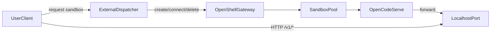

# OpenShell 整併手冊 + 自動化驗證腳本

此文件整併以下三份內容，提供單一入口：

- `pass/openshell-sandbox-runbook.md`
- `pass/openshell-validation-matrix.md`
- `pass/openshell-expert-scorecard.md`

並搭配自動化腳本：`pass/openshell-validate.sh`

## 1) Top-down Overview

- Control Plane：`openshell` 管理 gateway / sandbox / forward / logs
- Data Plane：sandbox 內執行 `opencode serve`，透過 `forward` 對外提供 API
- File Plane：以 `--upload`、`sandbox upload/download` 傳遞檔案（非 bind mount）
- Verification Plane：以 `ready / assign / recycle` + SLO 進行驗證



## 2) 標準操作（Runbook）

## TO-DO List

- [ ] `openshell gateway start` + `openshell status`
- [ ] 建立 sandbox（可含 `--upload`、`--forward`）
- [ ] `sandbox list/get/connect/logs` 驗證可用性
- [ ] 任務後 `sandbox delete`

核心命令：

```bash
openshell gateway start
openshell status
openshell sandbox create --name ocode-dev --upload .:/sandbox -- opencode
openshell sandbox list
openshell sandbox get ocode-dev
openshell sandbox connect ocode-dev
openshell logs ocode-dev --tail --source sandbox --level warn
openshell sandbox delete ocode-dev
```

## 3) 檔案傳遞（Mount 替代）

OpenShell 現況主路徑是 upload/download，不是 host bind mount。

```bash
# create-time upload
openshell sandbox create --name file-a --upload .:/sandbox -- opencode

# runtime upload
openshell sandbox upload file-a ./src /sandbox/src

# download
openshell sandbox download file-a /sandbox/output ./local-output
```

## 4) OpenCode serve（OpenAI-compatible）

```bash
openshell sandbox create --name ocode-api --forward 4096 -- opencode
openshell sandbox connect ocode-api
opencode serve --hostname 127.0.0.1 --port 4096

curl -sf http://localhost:4096/health
curl -sf http://localhost:4096/v1/models
```

## 5) 圖片機制驗證（外部 Dispatcher 對位）

| 階段 | 驗證點 | 建議 SLO |
|---|---|---|
| Ready | create 到可 connect + health pass | p95 < 120s |
| Assign | user 首次呼叫 API 成功率 | >= 99% |
| Recycle | delete/recreate 成功率與延遲 | >= 99%, p95 < 180s |
| Consistency | Dispatcher vs OpenShell 狀態一致 | 0 差異 |

## 6) 0.1% 專家級判準（Scorecard）

- 先定義 SLO / Error Budget，再做壓測
- Failure-first：先測 forward 中斷、連續重建、大檔 upload
- 證據鏈：命令、時間戳、回應碼、logs、MRE
- 分層評分：
  - L1 Correctness
  - L2 Stability
  - L3 Resilience
  - L4 Operability

Go / No-Go：

- Go：L1~L3 達標且總分 >= 90
- Conditional Go：80~89，附帶緩解與回滾
- No-Go：關鍵 SLO 未達或證據不完整

## 7) 自動化驗證腳本

腳本路徑：`pass/openshell-validate.sh`

### 範例 1：預設參數快速驗證

```bash
bash pass/openshell-validate.sh
```

### 範例 2：自訂 sandbox 與埠

```bash
bash pass/openshell-validate.sh \
  --sandbox-file file-a \
  --sandbox-api ocode-api \
  --port 4096
```

### 範例 3：保留 sandbox 供人工除錯

```bash
bash pass/openshell-validate.sh --keep
```

輸出：

- 證據與摘要存於 `pass/artifacts/openshell-validation-<timestamp>/`
